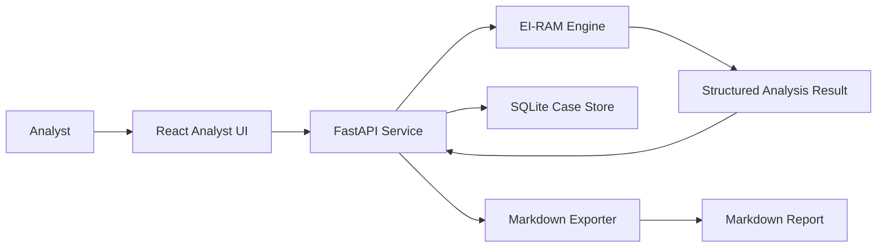

# Proposed Architecture

## Architecture Choice

Start with a local-first web app:

- Backend: FastAPI
- Frontend: React
- Storage: SQLite
- Engine: existing EI-RAM Python modules
- Packaging later: desktop shell or Seraphim module

## System Diagram

## Backend Responsibilities

- Expose analysis endpoint
- Adapt existing EI-RAM output into stable API response
- Save and retrieve cases
- Generate Markdown reports
- Validate input size and text shape
- Preserve audit-friendly intermediate fields

## Frontend Responsibilities

- Text intake
- Analysis state management
- Score and evidence visualization
- Case history navigation
- Report preview and export
- Clear limitations and confidence labels

## Storage Responsibilities

- Cases
- Source texts or source references
- Analysis results
- Tags
- Export records
- App settings

## Integration Strategy

Phase 1 should copy or import from the existing EI-RAM API only after the target structure is chosen. Until then, this folder remains a planning scaffold.

## Design Constraint

The app should feel like an analyst tool, not a marketing page. Dense, readable, dark, report-oriented, and built for repeated use.
