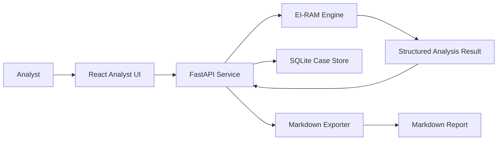

# EI-RAM Architecture

The normative authority for mission lifecycle, ownership, evidence, approvals,
and the six-plane model is
[`SERAPHIM_ARCHITECTURE_CONTRACT_V0_1.md`](../../../docs/architecture/SERAPHIM_ARCHITECTURE_CONTRACT_V0_1.md).
This document maps the current EI-RAM implementation to that contract; it does
not redefine it.

## Architecture Choice

Start with a local-first web app:

- Backend: FastAPI
- Frontend: React
- Storage: SQLite
- Engine: existing EI-RAM Python modules
- Packaging later: desktop shell or Seraphim module

## System Diagram

## Backend Responsibilities

- Expose analysis endpoint
- Adapt existing EI-RAM output into stable API response
- Save and retrieve cases
- Generate Markdown reports
- Validate input size and text shape
- Preserve audit-friendly intermediate fields

## Frontend Responsibilities

- Text intake
- Analysis state management
- Score and evidence visualization
- Case history navigation
- Report preview and export
- Clear limitations and confidence labels

## Storage Responsibilities

- Cases
- Source texts or source references
- Analysis results
- Tags
- Export records
- App settings

## Governed proof implementation

| Contract plane | Implemented proof component | Current boundary |
| --- | --- | --- |
| Interface | `POST /proof-missions` and `ProofMissionRequest` | Local synchronous API only |
| Command | `CaseController` and `CollectionManager` | Exactly one primary owner; three-task budget |
| Specialist | Two injected fixture workers | Synthetic, read-only, no network |
| Evidence | SQLite `CaseLedger`, evidence relationships, independence groups | Local proof database, not a production knowledge graph |
| Deliberation | `FusionEngine`, `RedTeam`, `CitationAuditor` | Three fixed hypotheses and one recollection loop |
| Governance | Capability snapshot, governing ruling, transition audit, citation gate | Repository manifest snapshot; no autonomous doctrine changes |

The completed proof preserves observations, source claims, analytical
judgments, unknowns, competing hypotheses, dissent, and citations as distinct
records. Closure stores lessons but cannot change skills, policy, architecture,
authorization, or the capability manifest.

Not implemented: live connected-source collection, remote multi-agent workers,
production evidence-graph infrastructure, persistent authority synchronization,
semantic APA/Bluebook validation, Watch Officer scheduling, ChatGPT delegation,
autonomous publication, production case interfaces, or private-case identity,
retention, deletion, and access-control policy.

## Design Constraint

The app should feel like an analyst tool, not a marketing page. Dense, readable, dark, report-oriented, and built for repeated use.
