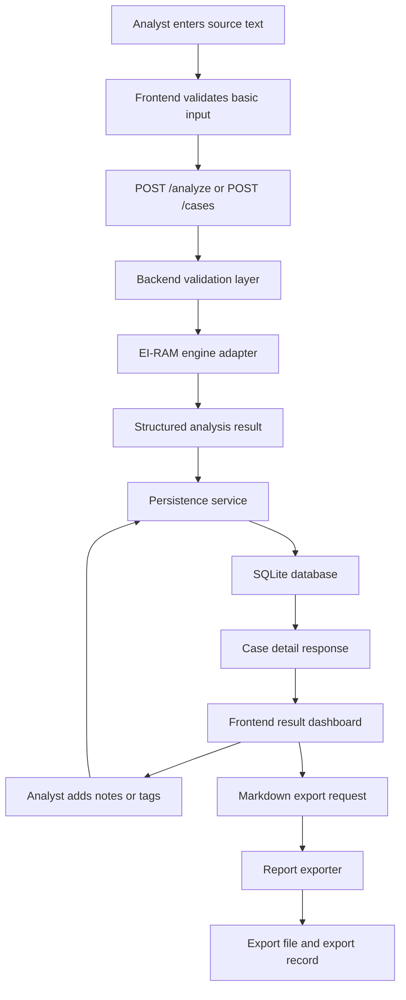
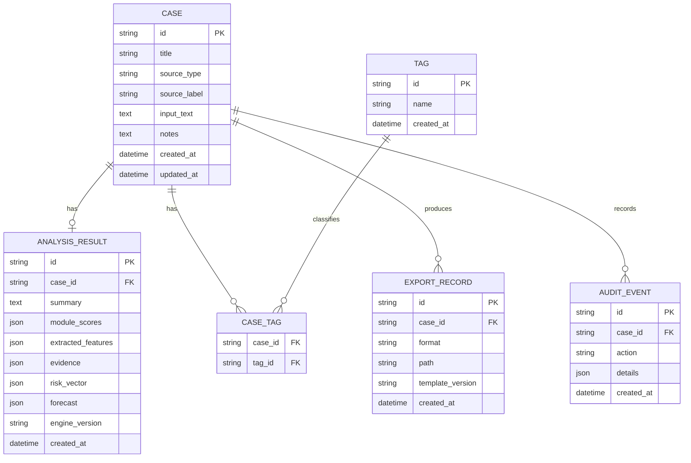

# Data Design Document

## EI-RAM Analysis Studio

### Revision History

| Version | Date | Author | Description |
|---|---|---|---|
| 0.1 | 2026-07-09 | Codex | Initial data design draft for EI-RAM Analysis Studio MVP |

## 1. Introduction

### 1.1 Purpose

This Data Design Document defines the data entities, storage model, data flow, validation rules, and data traceability for EI-RAM Analysis Studio.

The document supports the Software Design Document and Software Requirements Specification by describing how EI-RAM case data, source text, analysis results, analyst notes, and report exports are stored and retrieved.

### 1.2 Scope

This document covers the MVP data design for a local-first EI-RAM application using SQLite persistence.

MVP data scope includes:

- Analyst-created cases
- Pasted source text
- Structured EI-RAM analysis results
- Analyst notes
- Tags
- Markdown export records
- Optional audit events

Deferred data scope includes:

- PDF ingestion metadata
- DOCX ingestion metadata
- Public handle research metadata
- LLM deep-analysis records
- Vector search embeddings
- Multi-user authentication records

### 1.3 Reference Material

- `SDD.md`
- `REQUIREMENTS.md`
- `DATA_MODEL.md`
- `ARCHITECTURE.md`
- `ACADEMIC_AND_DESIGN_STANDARDS.md`
- Existing EI-RAM FastAPI engine source under `AGI Training/EI-RAM/eiram API`

### 1.4 Definitions and Acronyms

| Term | Definition |
|---|---|
| EI-RAM | Engine and framework for narrative, ideological, emotional, escalation, and forecast analysis |
| Case | A saved analysis workspace containing source text, metadata, notes, and analysis result |
| Analysis Result | Structured output produced by the EI-RAM engine |
| Evidence | Source snippets or feature matches that support analysis output |
| Risk Vector | Structured risk output generated by EI-RAM |
| Forecast | EI-RAM output describing projected direction, behavior, or interpretive trajectory |
| SQLite | Embedded local relational database used for MVP persistence |
| JSON | JavaScript Object Notation; used for nested analysis structures |

## 2. Data Design Overview

EI-RAM Analysis Studio uses a local SQLite database as the system of record for saved cases and analysis results. The deterministic EI-RAM engine returns nested structures such as module scores, extracted features, evidence, risk vectors, and forecasts. For the MVP, those nested structures are stored as JSON text fields to preserve the engine output without forcing premature normalization.

This choice supports three design goals:

- Keep the MVP simple enough to implement quickly.
- Preserve audit-friendly raw analysis structures.
- Allow later normalization if reporting, filtering, or analytics require it.

The primary data flow is:

1. Analyst submits source text.
2. Backend validates the input.
3. Backend sends text to EI-RAM engine adapter.
4. Engine returns structured analysis result.
5. Backend saves the case and result to SQLite.
6. Analyst reviews, notes, tags, and exports the case.

## 3. Data Flow



## 4. Entity Relationship Design



## 5. Logical Data Model

### 5.1 Case

The `Case` entity represents one saved analyst workspace. It is the parent record for source text, metadata, analyst notes, tags, analysis results, exports, and optional audit events.

Primary requirements supported:

- FR-009 Case Save
- FR-010 Case History
- FR-011 Case Reopen
- FR-012 Analyst Notes
- FR-015 Source Metadata
- FR-016 Tags
- DR-001 Case Record

### 5.2 AnalysisResult

The `AnalysisResult` entity stores structured EI-RAM output. It is attached to one case.

The MVP stores nested result data as JSON fields:

- `module_scores`
- `extracted_features`
- `evidence`
- `risk_vector`
- `forecast`

Primary requirements supported:

- FR-003 Analysis Execution
- FR-004 Structured Analysis Output
- FR-005 Module Score Display
- FR-006 Evidence Display
- FR-007 Risk Vector Display
- FR-008 Forecast Display
- DR-002 Analysis Result Record
- DR-004 Engine Version

### 5.3 Tag

The `Tag` entity stores reusable labels assigned by the analyst. Tags support organization and later filtering.

Primary requirements supported:

- FR-016 Tags
- DR-001 Case Record

### 5.4 CaseTag

The `CaseTag` join table supports a many-to-many relationship between cases and tags.

### 5.5 ExportRecord

The `ExportRecord` entity stores metadata for generated reports. The first supported format is Markdown.

Primary requirements supported:

- FR-013 Markdown Export
- FR-014 Export Record
- DR-003 Export Record

### 5.6 AuditEvent

The `AuditEvent` entity is optional for MVP but recommended because EI-RAM requires evidence visibility and analyst accountability. It records meaningful actions such as case creation, analysis execution, report export, and note updates.

Primary requirements supported:

- NFR-002 Evidence Transparency
- NFR-009 Auditability

## 6. Physical Data Design

The MVP should use SQLite with text primary keys. UUID strings are recommended to avoid collisions and to keep records portable if later exported or migrated.

### 6.1 Draft SQLite Schema

```sql
CREATE TABLE cases (
  id TEXT PRIMARY KEY,
  title TEXT NOT NULL,
  source_type TEXT NOT NULL DEFAULT 'pasted_text',
  source_label TEXT,
  input_text TEXT NOT NULL,
  notes TEXT,
  created_at TEXT NOT NULL,
  updated_at TEXT NOT NULL
);

CREATE TABLE analysis_results (
  id TEXT PRIMARY KEY,
  case_id TEXT NOT NULL UNIQUE,
  summary TEXT NOT NULL,
  module_scores TEXT NOT NULL,
  extracted_features TEXT NOT NULL,
  evidence TEXT NOT NULL,
  risk_vector TEXT NOT NULL,
  forecast TEXT NOT NULL,
  limitations TEXT,
  engine_version TEXT,
  created_at TEXT NOT NULL,
  FOREIGN KEY (case_id) REFERENCES cases(id) ON DELETE CASCADE
);

CREATE TABLE tags (
  id TEXT PRIMARY KEY,
  name TEXT NOT NULL UNIQUE,
  created_at TEXT NOT NULL
);

CREATE TABLE case_tags (
  case_id TEXT NOT NULL,
  tag_id TEXT NOT NULL,
  PRIMARY KEY (case_id, tag_id),
  FOREIGN KEY (case_id) REFERENCES cases(id) ON DELETE CASCADE,
  FOREIGN KEY (tag_id) REFERENCES tags(id) ON DELETE CASCADE
);

CREATE TABLE export_records (
  id TEXT PRIMARY KEY,
  case_id TEXT NOT NULL,
  format TEXT NOT NULL,
  path TEXT NOT NULL,
  template_version TEXT NOT NULL,
  created_at TEXT NOT NULL,
  FOREIGN KEY (case_id) REFERENCES cases(id) ON DELETE CASCADE
);

CREATE TABLE audit_events (
  id TEXT PRIMARY KEY,
  case_id TEXT,
  action TEXT NOT NULL,
  details TEXT,
  created_at TEXT NOT NULL,
  FOREIGN KEY (case_id) REFERENCES cases(id) ON DELETE SET NULL
);

CREATE INDEX idx_cases_created_at ON cases(created_at);
CREATE INDEX idx_cases_updated_at ON cases(updated_at);
CREATE INDEX idx_analysis_results_case_id ON analysis_results(case_id);
CREATE INDEX idx_export_records_case_id ON export_records(case_id);
CREATE INDEX idx_audit_events_case_id ON audit_events(case_id);
CREATE INDEX idx_audit_events_created_at ON audit_events(created_at);
```

### 6.2 JSON Storage Convention

SQLite does not require a separate JSON type. The MVP shall store JSON structures as valid JSON strings in `TEXT` columns.

The backend persistence layer shall:

- Serialize nested objects before writing.
- Validate that stored JSON can be parsed before returning it.
- Return parsed JSON objects to the frontend API consumer.

## 7. Data Dictionary

### 7.1 `cases`

| Field | Type | Required | Description |
|---|---|---:|---|
| `id` | TEXT | Yes | Unique case identifier |
| `title` | TEXT | Yes | Analyst-provided or generated case title |
| `source_type` | TEXT | Yes | Source category such as `pasted_text`, `txt`, `pdf`, `docx`, or `public_handle` |
| `source_label` | TEXT | No | Human-readable source name or label |
| `input_text` | TEXT | Yes | Source text submitted for analysis |
| `notes` | TEXT | No | Analyst notes attached to the case |
| `created_at` | TEXT | Yes | ISO 8601 timestamp for case creation |
| `updated_at` | TEXT | Yes | ISO 8601 timestamp for most recent case update |

### 7.2 `analysis_results`

| Field | Type | Required | Description |
|---|---|---:|---|
| `id` | TEXT | Yes | Unique analysis result identifier |
| `case_id` | TEXT | Yes | Foreign key to `cases.id` |
| `summary` | TEXT | Yes | Short EI-RAM summary |
| `module_scores` | TEXT JSON | Yes | JSON object containing module score data |
| `extracted_features` | TEXT JSON | Yes | JSON object containing extracted EI-RAM features |
| `evidence` | TEXT JSON | Yes | JSON array or object containing supporting evidence |
| `risk_vector` | TEXT JSON | Yes | JSON object describing risk output |
| `forecast` | TEXT JSON | Yes | JSON object describing forecast output |
| `limitations` | TEXT | No | Human-readable limitations and uncertainty notes |
| `engine_version` | TEXT | No | EI-RAM engine or adapter version |
| `created_at` | TEXT | Yes | ISO 8601 timestamp for analysis creation |

### 7.3 `tags`

| Field | Type | Required | Description |
|---|---|---:|---|
| `id` | TEXT | Yes | Unique tag identifier |
| `name` | TEXT | Yes | Unique tag name |
| `created_at` | TEXT | Yes | ISO 8601 timestamp for tag creation |

### 7.4 `case_tags`

| Field | Type | Required | Description |
|---|---|---:|---|
| `case_id` | TEXT | Yes | Foreign key to `cases.id` |
| `tag_id` | TEXT | Yes | Foreign key to `tags.id` |

### 7.5 `export_records`

| Field | Type | Required | Description |
|---|---|---:|---|
| `id` | TEXT | Yes | Unique export record identifier |
| `case_id` | TEXT | Yes | Foreign key to `cases.id` |
| `format` | TEXT | Yes | Export format, initially `markdown` |
| `path` | TEXT | Yes | Local path to exported report |
| `template_version` | TEXT | Yes | Report template version |
| `created_at` | TEXT | Yes | ISO 8601 timestamp for export creation |

### 7.6 `audit_events`

| Field | Type | Required | Description |
|---|---|---:|---|
| `id` | TEXT | Yes | Unique audit event identifier |
| `case_id` | TEXT | No | Related case ID when applicable |
| `action` | TEXT | Yes | Action name such as `case.created`, `analysis.run`, or `report.exported` |
| `details` | TEXT JSON | No | JSON object containing event details |
| `created_at` | TEXT | Yes | ISO 8601 timestamp for event creation |

## 8. API Data Shapes

### 8.1 Analyze Request

```json
{
  "title": "Sample Analysis",
  "source_type": "pasted_text",
  "source_label": "Manual input",
  "text": "Source text to analyze",
  "tags": ["sample", "training"]
}
```

### 8.2 Analyze Response

```json
{
  "case": {
    "id": "case_001",
    "title": "Sample Analysis",
    "source_type": "pasted_text",
    "source_label": "Manual input",
    "notes": null,
    "tags": ["sample", "training"],
    "created_at": "2026-07-09T00:00:00Z",
    "updated_at": "2026-07-09T00:00:00Z"
  },
  "analysis": {
    "id": "analysis_001",
    "case_id": "case_001",
    "summary": "Short analysis summary.",
    "module_scores": {},
    "extracted_features": {},
    "evidence": [],
    "risk_vector": {},
    "forecast": {},
    "limitations": "This analysis is limited to the submitted text.",
    "engine_version": "eiram-mvp-0.1",
    "created_at": "2026-07-09T00:00:00Z"
  }
}
```

### 8.3 Case List Response

```json
{
  "cases": [
    {
      "id": "case_001",
      "title": "Sample Analysis",
      "source_type": "pasted_text",
      "source_label": "Manual input",
      "tags": ["sample", "training"],
      "created_at": "2026-07-09T00:00:00Z",
      "updated_at": "2026-07-09T00:00:00Z"
    }
  ]
}
```

### 8.4 Markdown Export Response

```json
{
  "export": {
    "id": "export_001",
    "case_id": "case_001",
    "format": "markdown",
    "path": "exports/case_001_report.md",
    "template_version": "report-template-0.1",
    "created_at": "2026-07-09T00:00:00Z"
  }
}
```

## 9. Validation Rules

### 9.1 Input Text

- `input_text` shall not be empty.
- `input_text` shall be trimmed before validation.
- The MVP should enforce a maximum input length.
- The recommended initial maximum is 50,000 characters.

### 9.2 Title

- `title` shall not be empty after trimming.
- If no title is provided, the system may generate one from the first sentence or timestamp.

### 9.3 Source Type

Allowed MVP values:

- `pasted_text`
- `txt`
- `markdown`

Deferred values:

- `pdf`
- `docx`
- `public_handle`
- `url`

### 9.4 Tags

- Tag names should be trimmed.
- Empty tag names shall be ignored.
- Tag names should be stored case-insensitively or normalized to lowercase.

### 9.5 JSON Fields

The backend shall validate that `module_scores`, `extracted_features`, `evidence`, `risk_vector`, and `forecast` are serializable to JSON before saving.

## 10. Data Lifecycle

### 10.1 Case Creation

Case creation occurs when an analyst submits text for analysis and elects to save the result. The MVP may combine analysis and case creation into one workflow.

### 10.2 Case Update

Case updates occur when the analyst changes:

- Title
- Source label
- Notes
- Tags

The system shall update `updated_at` on meaningful case changes.

### 10.3 Case Deletion

Deleting a case shall remove the associated analysis result, tag links, and export records from the database through cascading deletes.

Exported files may remain on disk unless the system later implements explicit file cleanup.

### 10.4 Export Creation

Markdown export creates:

- A report file on disk
- An `export_records` row
- An optional audit event

### 10.5 Retention

The MVP shall retain saved cases until the analyst deletes them.

## 11. Data Security and Safety

The MVP is local-first and single-user. Even so, EI-RAM may process sensitive text, so data handling should follow conservative rules.

Required safeguards:

- Store data locally by default.
- Do not transmit deterministic analysis input to an external service.
- Do not hide source text from the analyst.
- Keep report limitations visible.
- Avoid storing secrets in source labels, tags, or notes.

Deferred safeguards:

- Database encryption
- User authentication
- Export redaction tools
- Secure deletion
- Per-case sensitivity labels

## 12. Data Portability

The data model should support future export or migration.

Recommended portability features:

- UUID-style text IDs
- ISO 8601 timestamps
- JSON fields that preserve original engine output
- Markdown reports that can stand apart from the database
- Avoid database-specific features beyond standard SQLite where possible

## 13. Data Design Rationale

### 13.1 SQLite for MVP

SQLite is appropriate because EI-RAM Analysis Studio is local-first, single-user, and does not require cloud deployment for deterministic analysis. It reduces setup complexity while still providing reliable relational storage.

### 13.2 JSON Fields for Engine Output

EI-RAM output contains nested scoring, feature, evidence, and forecast data. Storing these structures as JSON in the MVP avoids premature schema complexity and preserves the engine's raw structure for audit and future migration.

### 13.3 Separate Export Records

Exports are stored separately from analysis results because one case may produce multiple reports over time, especially after notes, tags, or report templates change.

### 13.4 Optional Audit Events

Audit events are included because EI-RAM's trust model depends on traceability. Even if audit UI is deferred, the database should support future action history.

## 14. Requirements Traceability Matrix

| Requirement | Data Element or Table | Design Support |
|---|---|---|
| FR-001 | `cases.input_text` | Stores pasted text submitted by analyst |
| FR-002 | Validation rules | Rejects empty input before persistence |
| FR-003 | `analysis_results` | Stores deterministic EI-RAM output |
| FR-004 | `analysis_results` JSON fields | Preserves structured output |
| FR-005 | `analysis_results.module_scores` | Stores module score data |
| FR-006 | `analysis_results.evidence` | Stores evidence and feature matches |
| FR-007 | `analysis_results.risk_vector` | Stores risk vector |
| FR-008 | `analysis_results.forecast` | Stores forecast |
| FR-009 | `cases` | Saves case record |
| FR-010 | `cases` indexes | Supports case history ordered by date |
| FR-011 | `cases`, `analysis_results` | Reopens saved case and result |
| FR-012 | `cases.notes` | Stores analyst notes |
| FR-013 | `export_records`, report file | Tracks Markdown report generation |
| FR-014 | `export_records` | Stores export metadata |
| FR-015 | `cases.source_type`, `cases.source_label` | Stores source metadata |
| FR-016 | `tags`, `case_tags` | Stores case tags |
| NFR-001 | SQLite database | Supports local-first operation |
| NFR-002 | Evidence JSON fields | Preserves evidence transparency |
| NFR-004 | All tables | Provides data persistence |
| NFR-009 | `analysis_results`, `audit_events` | Supports auditability |
| DR-001 | `cases`, `tags`, `case_tags` | Persists case record |
| DR-002 | `analysis_results` | Persists analysis result |
| DR-003 | `export_records` | Persists export metadata |
| DR-004 | `analysis_results.engine_version` | Stores engine version |

## 15. Open Issues

| ID | Issue | Status |
|---|---|---|
| DD-001 | Final maximum input length must be confirmed | Open |
| DD-002 | Report export directory must be selected | Open |
| DD-003 | Decision needed on whether audit events are MVP or early phase 2 | Open |
| DD-004 | Decision needed on whether exported files should be deleted when a case is deleted | Open |
| DD-005 | Decision needed on database encryption before processing sensitive source material | Open |

## 16. Appendices

### Appendix A: Candidate File Layout

```text
03_EIRAM_Analysis_Studio/
  app/
    backend/
      app/
        main.py
        db.py
        models.py
        schemas.py
        repositories.py
        services/
          analysis_service.py
          export_service.py
    frontend/
    shared/
  data/
    eiram.sqlite3
    exports/
  docs/
    DATA_DESIGN_DOCUMENT.md
```

### Appendix B: Deferred Normalized Analysis Tables

If future reporting requires advanced filtering, the following tables may be added:

- `module_scores`
- `evidence_items`
- `extracted_features`
- `forecast_items`
- `risk_components`

These are deferred because the MVP can preserve the full analysis output in JSON while reducing initial implementation complexity.
