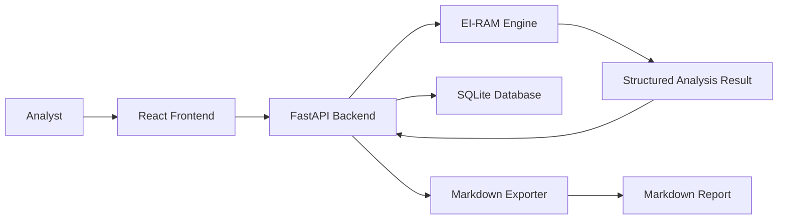

# Software Design Document

## EI-RAM Analysis Studio

### 1. Purpose

EI-RAM Analysis Studio is a local-first analyst workbench for examining text through the EI-RAM framework: narrative structure, ideological rigidity, vulnerability signals, escalation risk, epistemic elasticity, and predictive forecast.

The system is designed to help an analyst inspect evidence, understand risk signals, save cases, and export structured reports.

### 2. Scope

MVP scope:

- Paste text into an intake panel
- Run deterministic EI-RAM analysis
- Display summary, scores, evidence, risk vector, and forecast
- Save analysis cases locally
- Reopen previous cases
- Export Markdown reports

Deferred scope:

- PDF and DOCX ingestion
- LLM-powered deep analysis
- Public handle research UI
- Batch comparison
- Seraphim Command Center integration
- PDF and DOCX export

### 3. System Architecture



### 4. Major Components

#### Frontend

- Text Intake View
- Analysis Dashboard
- Evidence Review Panel
- Case History View
- Report Preview
- Settings View

#### Backend

- FastAPI application
- EI-RAM engine adapter
- Case persistence service
- Report export service
- Input validation layer
- Error handling layer

#### Engine

- Deterministic scoring modules
- Feature extraction
- Evidence extraction
- Risk vector calculation
- Forecast generation

#### Database

- SQLite local database
- Stores cases, results, tags, notes, and exports

### 5. Draft Data Model

#### Case

- `id`
- `title`
- `source_type`
- `source_label`
- `input_text`
- `tags`
- `notes`
- `created_at`
- `updated_at`

#### AnalysisResult

- `id`
- `case_id`
- `summary`
- `module_scores`
- `extracted_features`
- `risk_vector`
- `evidence`
- `forecast`
- `engine_version`
- `created_at`

#### ExportRecord

- `id`
- `case_id`
- `format`
- `path`
- `template_version`
- `created_at`

### 6. API Design

MVP endpoints:

```text
POST /analyze
GET  /cases
GET  /cases/{case_id}
POST /cases
DELETE /cases/{case_id}
POST /cases/{case_id}/export/markdown
```

Primary analysis request:

```json
{
  "title": "Sample Analysis",
  "source_type": "pasted_text",
  "source_label": "Manual input",
  "text": "..."
}
```

Primary analysis response:

```json
{
  "summary": "...",
  "module_scores": {},
  "extracted_features": {},
  "risk_vector": {},
  "evidence": [],
  "forecast": {}
}
```

### 7. UI Design

The UI should feel like an analyst console:

- Dark interface
- Dense but readable panels
- No marketing-style landing page
- Clear score cards
- Evidence-first layout
- Export button always visible after analysis
- Case history in left sidebar or secondary panel

Primary screen layout:

```text
-------------------------------------------------
Top Bar: EI-RAM Analysis Studio | New | Export
-------------------------------------------------
Left: Case History
Center: Text Intake / Result Summary
Right: Module Scores + Risk Vector
Bottom: Evidence + Forecast + Limitations
-------------------------------------------------
```

### 8. Safety and Trust Design

EI-RAM must not claim certainty beyond available evidence.

Required output rules:

- Always show limitations
- Always separate evidence from inference
- Always include confidence language
- Do not label people as dangerous
- Do not present scores as diagnosis
- Do not treat political, ideological, or emotional scoring as proof of intent

### 9. Error Handling

Expected errors:

- Empty input
- Input too long
- Engine failure
- Database write failure
- Export failure
- Unsupported file type in a later phase

User-facing errors should be plain and recoverable.

Example:

```text
Analysis could not be completed because the input text is empty.
```

### 10. Testing Plan

MVP tests:

- Engine adapter returns expected fields
- Empty input is rejected
- Case saves successfully
- Saved case can be reopened
- Markdown export includes summary, scores, evidence, and limitations
- API returns stable JSON shape

### 11. Build Strategy

Recommended first implementation:

- Reuse the existing EI-RAM FastAPI engine
- Add SQLite persistence
- Add Markdown export
- Build a simple React frontend
- Keep everything local-first
- Integrate with Seraphim later, after standalone MVP works

### 12. Design Decision

EI-RAM should start as a standalone focused tool, not as another tab buried inside Seraphim.

Reason: it has enough identity to deserve its own clean workspace. Once stable, Seraphim can launch it, consume its reports, or embed it as a module.
