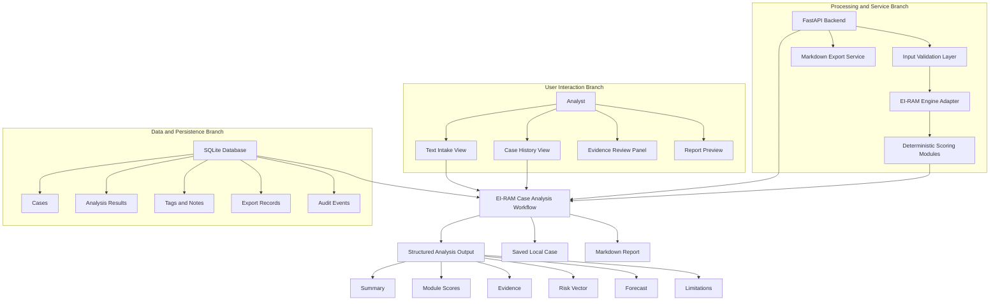

# Software Y-Drawing

## EI-RAM Analysis Studio

### 1. Purpose

This document provides a Y-shaped software architecture drawing for EI-RAM Analysis Studio. The drawing shows how the analyst-facing interface, backend processing services, and local data layer converge into the core EI-RAM case-analysis workflow.

The Software Y-Drawing supports the Software Design Document, Requirements Document, and Data Design Document by giving a compact visual summary of the MVP system structure.

### 2. Software Y-Drawing



### 3. ASCII View

```text
                 USER INTERACTION
          Analyst, Intake, Case History,
          Evidence Review, Report Preview
                       \\
                        \\
                         \\
                          v
                 EI-RAM CASE ANALYSIS
                         CORE
                          ^
                         / \\
                        /   \\
                       /     \\
       PROCESSING SERVICES    DATA AND PERSISTENCE
       FastAPI, Validation,   SQLite, Cases, Results,
       Engine Adapter,        Tags, Notes, Exports,
       Scoring, Exporter      Audit Events
```

### 4. Branch Descriptions

#### 4.1 User Interaction Branch

The user interaction branch contains everything the analyst directly touches. It includes the intake workspace, saved case list, evidence review surface, and report preview. This branch exists to make EI-RAM analysis inspectable rather than hidden behind a black-box response.

Primary supported requirements:

- FR-001 Text Intake
- FR-005 Module Score Display
- FR-006 Evidence Display
- FR-010 Case History
- FR-011 Case Reopen
- UIR-001 Main Workspace
- UIR-003 Score Cards
- UIR-004 Evidence Panel
- UIR-005 Export Control

#### 4.2 Processing and Service Branch

The processing branch contains the backend application services. The FastAPI backend receives requests, validates input, calls the EI-RAM engine adapter, receives structured deterministic scoring output, and sends report requests to the Markdown export service.

Primary supported requirements:

- FR-002 Input Validation
- FR-003 Analysis Execution
- FR-004 Structured Analysis Output
- FR-013 Markdown Export
- IR-001 Analyze Endpoint
- IR-004 Save Case Endpoint
- IR-005 Markdown Export Endpoint
- NFR-008 Maintainability

#### 4.3 Data and Persistence Branch

The data branch contains the SQLite database and durable local records. It stores cases, analysis results, tags, analyst notes, export records, and optional audit events. This branch supports local-first operation and preserves enough structure for later review and traceability.

Primary supported requirements:

- FR-009 Case Save
- FR-012 Analyst Notes
- FR-014 Export Record
- FR-015 Source Metadata
- FR-016 Tags
- DR-001 Case Record
- DR-002 Analysis Result Record
- DR-003 Export Record
- DR-004 Engine Version
- NFR-004 Data Persistence
- NFR-009 Auditability

### 5. Core Workflow

The center of the Y is the EI-RAM Case Analysis Workflow. It coordinates the three branches:

1. The analyst submits text through the UI.
2. The backend validates the request.
3. The EI-RAM engine adapter runs deterministic analysis.
4. The persistence layer saves the case and analysis result.
5. The frontend displays the summary, scores, evidence, risk vector, forecast, and limitations.
6. The analyst may add notes, tag the case, reopen it later, or export a Markdown report.

### 6. Design Rationale

The Y-Drawing separates the system into three major concerns:

- The analyst experience
- The processing pipeline
- The persistent data model

This layout matches the MVP architecture because EI-RAM Analysis Studio is not merely a text processor. It must also preserve evidence, save cases, support review, and generate reports. The three-branch drawing makes those responsibilities visible without overloading the diagram with implementation details.

### 7. Traceability Summary

| Branch | Main Components | Primary Requirements |
|---|---|---|
| User Interaction | Intake, case history, evidence review, report preview | FR-001, FR-005, FR-006, FR-010, FR-011, UIR-001, UIR-003, UIR-004, UIR-005 |
| Processing and Services | FastAPI, validation, engine adapter, scoring modules, exporter | FR-002, FR-003, FR-004, FR-013, IR-001, IR-004, IR-005, NFR-008 |
| Data and Persistence | SQLite, cases, results, tags, exports, audit events | FR-009, FR-012, FR-014, FR-015, FR-016, DR-001, DR-002, DR-003, DR-004, NFR-004, NFR-009 |

### 8. Notes for SDD Integration

This drawing should be referenced from the SDD under:

- `3. System Architecture`
- `3.1 Architectural Design`
- `3.2 Decomposition Description`
- `4. Data Design`

It can also support a future UML component diagram and sequence diagram.
