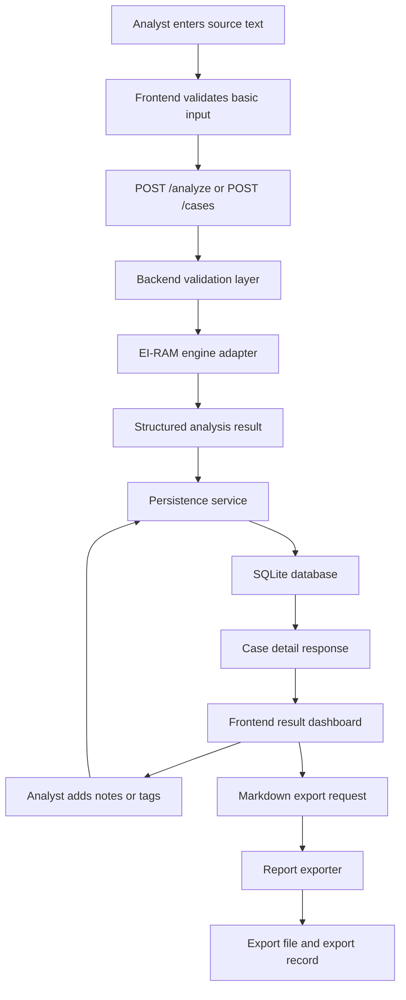
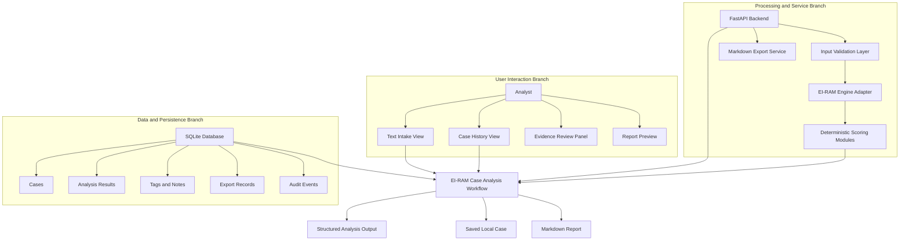
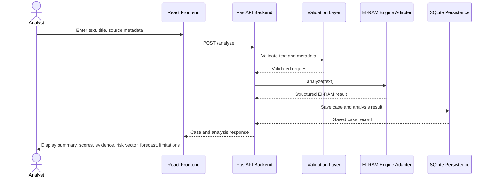
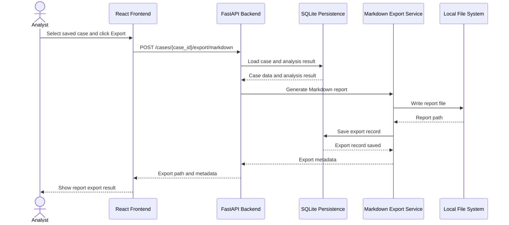
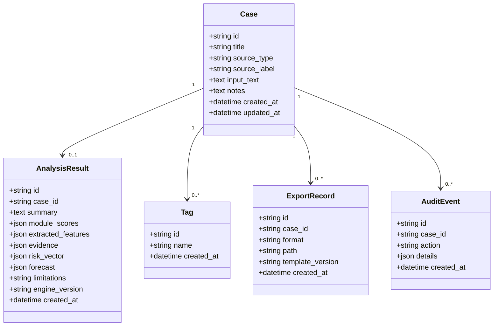
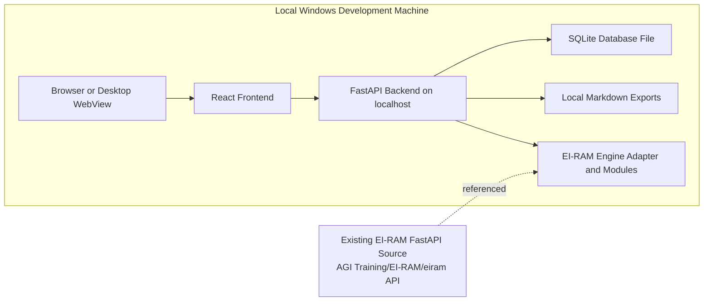
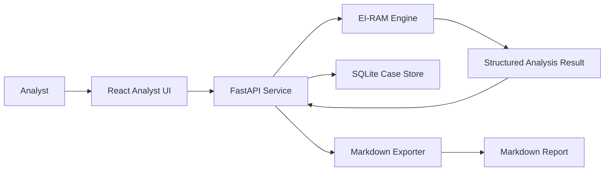
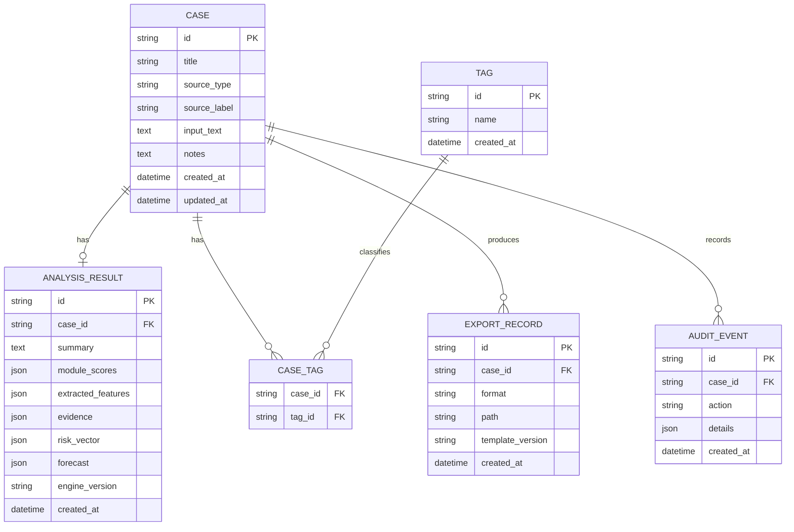
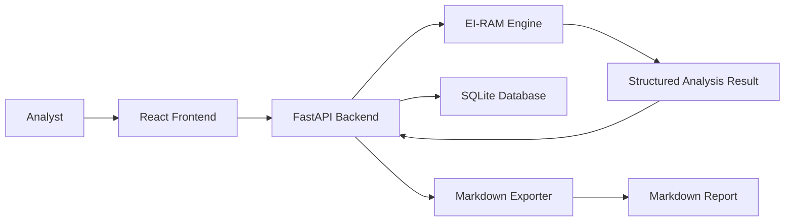
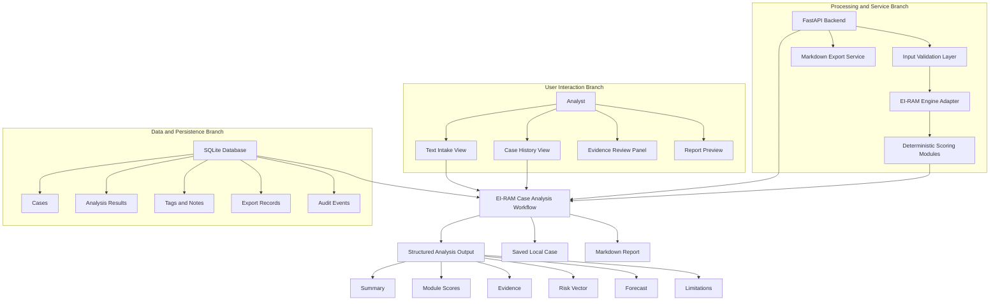

# Unified Architecture Document

## EI-RAM Analysis Studio

### Document Control

| Field | Value |
|---|---|
| Product | EI-RAM Analysis Studio |
| Baseline | EIRAM-STUDIO-0.1 |
| Document Type | Unified system, architecture, engineering, and codebase export document |
| Generated | 2026-07-09 01:32:54 local time |
| Source Repository | `C:\Users\cyber\OneDrive\Documents\Projects\Programs\SeraphimGPT\App_Portfolio\03_EIRAM_Analysis_Studio` |
| Files Exported | 22 |
| Implementation Status | Documentation-first, pre-implementation baseline |

## 1. System Overview

### 1.1 Purpose

EI-RAM Analysis Studio is planned as a local-first analyst workbench for structured text analysis using the EI-RAM framework. The system is intended to let an analyst paste source text, run deterministic EI-RAM scoring, inspect evidence, save cases locally, add notes and tags, reopen prior cases, and export Markdown reports.

The purpose of this unified document is to give a new engineer enough context to understand, rebuild, and continue the EI-RAM Analysis Studio project from the current baseline.

### 1.2 High-Level Description

EI-RAM Analysis Studio is currently a design and planning repository. It does not yet contain executable backend, frontend, database, or test implementation code. The repository contains project standards, a project brief, a Software Design Document, Requirements document, Data Design Document, Software Y-Drawing, SCI/VDD, Software Accomplishment Summary, roadmap, and placeholders for future application code.

The planned application follows a local-first client/server architecture:

- A React frontend will provide the analyst workspace.
- A FastAPI backend will expose analysis, case, and export endpoints.
- An EI-RAM engine adapter will wrap the existing deterministic EI-RAM engine.
- SQLite will store cases, structured analysis results, tags, notes, export records, and optional audit events.
- Markdown export will produce report artifacts for saved cases.

### 1.3 Major Subsystems

| Subsystem | Current Status | Planned Responsibility |
|---|---|---|
| Analyst UI | Placeholder | Text intake, result dashboard, case history, evidence review, notes, tags, export controls |
| Backend API | Placeholder | Request validation, case endpoints, analysis endpoint, export endpoint, error handling |
| EI-RAM Engine Adapter | Planned | Calls deterministic EI-RAM scoring modules and normalizes output shape |
| Persistence Layer | Planned | SQLite schema, repositories, migrations, local case storage |
| Export Service | Planned | Markdown report generation and export-record persistence |
| Documentation and Standards | Implemented as Markdown docs | Governs academic, SDD, SRS, UML, and traceability style |
| Tests | Placeholder | Engine adapter, API shape, validation, persistence, export, UI workflow tests |

### 1.4 Current Repository Tree

```text
03_EIRAM_Analysis_Studio/
  ACADEMIC_AND_DESIGN_STANDARDS.md
  AGENTS.md
  PROJECT_BRIEF.md
  README.md
  app/
    backend/README.md
    frontend/README.md
    shared/README.md
  data/
    samples/README.md
  docs/
    ARCHITECTURE.md
    DATA_DESIGN_DOCUMENT.md
    DATA_MODEL.md
    INGESTION_NOTES.md
    MVP_PLAN.md
    REPORT_TEMPLATE.md
    REQUIREMENTS.md
    ROADMAP.md
    SCI_VDD.md
    SDD.md
    SOFTWARE_ACCOMPLISHMENT_SUMMARY.md
    SOFTWARE_Y_DRAWING.md
    UNIFIED_ARCHITECTURE_DOCUMENT.md
  research/README.md
  tests/README.md
```

## 2. Architecture

### 2.1 Architectural Style

The planned architecture is a local-first layered client/server system. The project separates the user interface, API layer, analysis engine adapter, persistence layer, and export service. This separation supports maintainability, testability, auditability, and later integration with the larger Seraphim Command Center.

### 2.2 Module Breakdown

| Module | Path | Responsibilities | Status |
|---|---|---|---|
| Backend | `app/backend` | FastAPI app, schemas, repositories, services, EI-RAM adapter | Placeholder |
| Frontend | `app/frontend` | React analyst UI | Placeholder |
| Shared | `app/shared` | Shared schemas, constants, report template metadata | Placeholder |
| Data Samples | `data/samples` | Safe sample inputs for demos and tests | Placeholder |
| Docs | `docs` | Requirements, design, architecture, data design, SCI/VDD, accomplishment summary | Active |
| Research | `research` | Source notes, references, scoring definitions | Placeholder |
| Tests | `tests` | Unit, API, workflow, persistence, and export tests | Placeholder |

### 2.3 Components and Responsibilities

| Component | Responsibility |
|---|---|
| Text Intake View | Accept pasted text and source metadata from the analyst |
| Case History View | List saved cases and support reopening prior analyses |
| Evidence Review Panel | Display evidence snippets and feature matches contributing to the analysis |
| Report Preview | Display generated Markdown report content before or after export |
| FastAPI Backend | Expose API endpoints, validate requests, coordinate services |
| Input Validation Layer | Reject empty or invalid input and enforce size limits |
| EI-RAM Engine Adapter | Normalize calls to the existing EI-RAM engine and preserve structured output |
| Deterministic Scoring Modules | Produce module scores, extracted features, risk vector, evidence, and forecast |
| Persistence Service | Save and retrieve cases, tags, analysis results, export records, and audit events |
| Markdown Export Service | Generate reports from saved cases and record export metadata |
| SQLite Database | Local system of record for MVP case persistence |

### 2.4 Data Flow Diagram



### 2.5 Software Y-Drawing



### 2.6 Sequence Diagram: Run and Save Analysis



### 2.7 Sequence Diagram: Export Markdown Report



### 2.8 Class/Data Model Diagram



### 2.9 Deployment Topology



### 2.10 API and Interface Definitions

Planned MVP endpoints:

| Method | Endpoint | Responsibility |
|---|---|---|
| POST | `/analyze` | Analyze source text and optionally create a saved case |
| GET | `/cases` | Return saved case list |
| GET | `/cases/{case_id}` | Return one saved case and its analysis result |
| POST | `/cases` | Save a case |
| DELETE | `/cases/{case_id}` | Delete a saved case |
| POST | `/cases/{case_id}/export/markdown` | Generate Markdown report and export record |

Primary analysis request:

```json
{
  "title": "Sample Analysis",
  "source_type": "pasted_text",
  "source_label": "Manual input",
  "text": "Source text to analyze",
  "tags": ["sample", "training"]
}
```

Primary analysis response:

```json
{
  "case": {
    "id": "case_001",
    "title": "Sample Analysis",
    "source_type": "pasted_text",
    "source_label": "Manual input",
    "notes": null,
    "tags": ["sample", "training"],
    "created_at": "2026-07-09T00:00:00Z",
    "updated_at": "2026-07-09T00:00:00Z"
  },
  "analysis": {
    "id": "analysis_001",
    "case_id": "case_001",
    "summary": "Short analysis summary.",
    "module_scores": {},
    "extracted_features": {},
    "evidence": [],
    "risk_vector": {},
    "forecast": {},
    "limitations": "This analysis is limited to the submitted text.",
    "engine_version": "eiram-mvp-0.1",
    "created_at": "2026-07-09T00:00:00Z"
  }
}
```

### 2.11 Configuration Structure

Current configuration is documentation-only. Planned runtime configuration should include:

| Configuration Item | Purpose | Example |
|---|---|---|
| `EIRAM_DB_PATH` | SQLite database location | `data/eiram.sqlite3` |
| `EIRAM_EXPORT_DIR` | Markdown report export directory | `data/exports` |
| `EIRAM_MAX_INPUT_CHARS` | Input validation limit | `50000` |
| `EIRAM_ENGINE_MODE` | Engine selection | `deterministic` |
| `EIRAM_ENABLE_AUDIT` | Audit event persistence | `true` |

### 2.12 Dependencies and External Services

Current repository dependencies are documentary only. Planned dependencies:

| Dependency | Purpose | Required for MVP |
|---|---|---|
| Python | Backend runtime | Yes |
| FastAPI | Backend web framework | Yes |
| Uvicorn | Local API server | Yes |
| Pydantic | Request/response schemas | Yes |
| SQLite | Local persistence | Yes |
| React | Frontend UI | Yes |
| Vite or equivalent | Frontend dev/build tooling | Likely |
| Existing EI-RAM engine | Deterministic analysis | Yes |
| LLM provider | Optional deep analysis | Deferred |
| PDF/DOCX parsers | Document ingestion | Deferred |

## 3. Codebase Export

### 3.1 Export Method

This section flattens the current repository into one readable section. It includes every current file under the EI-RAM Analysis Studio project folder except this generated unified document itself. The repository is documentation-first, so most files are Markdown documents or placeholder README files.

### 3.2 Exported File Index

| File | Bytes |
|---|---:|
| `ACADEMIC_AND_DESIGN_STANDARDS.md` | 8022 |
| `AGENTS.md` | 1022 |
| `app/backend/README.md` | 299 |
| `app/frontend/README.md` | 243 |
| `app/shared/README.md` | 292 |
| `data/samples/README.md` | 299 |
| `docs/ARCHITECTURE.md` | 1495 |
| `docs/DATA_DESIGN_DOCUMENT.md` | 19767 |
| `docs/DATA_MODEL.md` | 913 |
| `docs/INGESTION_NOTES.md` | 686 |
| `docs/MVP_PLAN.md` | 1153 |
| `docs/REPORT_TEMPLATE.md` | 715 |
| `docs/REQUIREMENTS.md` | 9179 |
| `docs/ROADMAP.md` | 961 |
| `docs/SCI_VDD.md` | 9705 |
| `docs/SDD.md` | 4798 |
| `docs/SOFTWARE_ACCOMPLISHMENT_SUMMARY.md` | 9648 |
| `docs/SOFTWARE_Y_DRAWING.md` | 5940 |
| `PROJECT_BRIEF.md` | 1907 |
| `README.md` | 1288 |
| `research/README.md` | 281 |
| `tests/README.md` | 242 |

### 3.3 `ACADEMIC_AND_DESIGN_STANDARDS.md`

```markdown
# Academic and Design Documentation Standards

## Purpose

This document captures the working standards to use for SeraphimGPT app portfolio documentation, especially EI-RAM Analysis Studio.

It distills local course resources supplied by the operator:

- `Comprehensive_Academic_Writing_and_APA_7th_Guide.pdf`
- `SDD_Template.pdf`
- `SoftwareArchitectureDocumentation.pdf`
- `uml.pdf`
- `Writing for Success.pdf`

Use this file as the project memory for future writing, SDD, requirements, architecture, and UML work.

## Academic Writing Standards

### College-Level Writing

Project documents should move beyond summary into analysis, synthesis, rationale, and evidence-backed decisions.

Writing should:

- State purpose clearly.
- Define scope and audience.
- Use direct, organized sections.
- Support claims with evidence or design rationale.
- Distinguish facts, assumptions, decisions, and open questions.
- Avoid vague filler and unsupported certainty.

### Writing Process

Use a recursive drafting process:

- Plan the document structure.
- Draft the major sections.
- Revise for logic, completeness, and flow.
- Edit for grammar, mechanics, and formatting.
- Proofread final deliverables before submission or export.

### Sentence and Paragraph Quality

Prefer concise, complete sentences with clear subjects and verbs.

Paragraphs should:

- Open with a controlling idea.
- Develop one main point.
- Use transitions where needed.
- Avoid burying key claims inside long sentence chains.

## APA 7 Working Rules

When a document is academic or course-facing, apply APA 7 expectations unless the assignment says otherwise.

### Format

- Use 1-inch margins.
- Use readable academic fonts such as 11-point Calibri, 11-point Arial, or 12-point Times New Roman when producing formal documents.
- Double-space formal academic papers unless the target template requires otherwise.
- Include page numbers in formal deliverables.
- Use consistent heading hierarchy.

### Title Page

Student title pages should include:

- Paper title
- Author name
- Institutional affiliation
- Course number and name
- Instructor name
- Due date

### Headings

Use APA-style heading hierarchy for formal academic papers:

- Level 1: Centered, bold, title case
- Level 2: Flush left, bold, title case
- Level 3: Flush left, bold italic, title case
- Level 4: Indented, bold, title case, period, inline text
- Level 5: Indented, bold italic, title case, period, inline text

For engineering Markdown documents, use clear numbered sections when that better matches the SDD/SRS template.

### Citations

Use author-date in-text citations for paraphrases, summaries, concepts, data, direct quotes, and borrowed frameworks.

Use parenthetical or narrative form consistently:

- Parenthetical: `(Author, Year)`
- Narrative: `Author (Year)`

### References

Formal academic documents should include a `References` section.

Reference entries should:

- Be alphabetized by lead author.
- Use hanging indent in final Word/PDF form.
- Include DOI or URL when applicable.
- Follow APA 7 source patterns.

## SDD Standards

The Software Design Document should follow the local SDD template structure adapted from IEEE 1016.

### Required SDD Sections

1. Introduction
   - Purpose
   - Scope
   - Overview
   - Reference Material
   - Definitions and Acronyms
2. System Overview
3. System Architecture
   - Architectural Design
   - Decomposition Description
   - Design Rationale
4. Data Design
   - Data Description
   - Data Dictionary
5. Component Design
6. Human Interface Design
   - Overview of User Interface
   - Screen Images or Wireframes
   - Screen Objects and Actions
7. Requirements Matrix
8. Appendices

### SDD Quality Rules

An SDD should be useful to programmers.

It should include:

- Enough implementation detail to guide coding.
- Clear component boundaries.
- Interface definitions.
- Data structures and storage decisions.
- Design rationale and tradeoffs.
- Traceability from requirements to components.
- Diagrams or wireframes where they clarify the design.

Avoid:

- Treating the SDD as a marketing overview.
- Leaving architecture choices unexplained.
- Omitting data design.
- Omitting requirements traceability.

## Architecture Documentation Standards

Architecture documentation should describe how the system is structured to satisfy functional requirements and quality attributes.

### Expected Architecture Content

Include:

- Revision history
- Introduction
- Background
- Architecturally significant functional requirements
- Quality attributes
- Architecture overview
- System context
- User interactions
- Data flow
- Patterns and tactics
- Views
- Rationale
- Glossary
- Issues list
- References

### Quality Attributes

For EI-RAM and related apps, explicitly consider:

- Usability
- Availability
- Maintainability
- Testability
- Security
- Auditability
- Local-first operation
- Data portability

Use quality-attribute scenarios where useful:

- Source
- Stimulus
- Artifact
- Environment
- Response
- Response measure

### Architecture Views

Use multiple views when the design is complex:

- System context view
- Logical/layered view
- Process view
- Data view
- Deployment view
- Interface view

Each view should include:

- Diagram
- Notation explanation
- Element catalog
- Relationships
- Interfaces
- Rationale

### Pattern and Tactic Documentation

When choosing an architecture, identify relevant patterns and tactics.

Candidate patterns for EI-RAM:

- Client-server
- Layered architecture
- Model-view-controller or frontend/backend separation
- Repository/data mapper for persistence
- Service layer for analysis and export workflows

Discuss why selected patterns fit the requirements.

## UML Standards

UML diagrams should be used when they clarify system structure, behavior, or interactions.

Use diagram types intentionally:

- Use case diagram: actors and system goals
- Activity diagram: workflow and decision flow
- Class diagram: domain objects and relationships
- Sequence diagram: runtime interactions between user, UI, API, engine, database, and exporter
- Component diagram: deployable or logical components
- Deployment diagram: runtime nodes and where components run

### UML Expectations

Diagrams should:

- Have clear titles.
- Include only relevant elements.
- Use consistent notation.
- Avoid visual clutter.
- Match the written architecture and requirements.
- Be referenced from the document text.

For EI-RAM MVP, prioritize:

- Use case diagram
- Activity diagram for analysis workflow
- Component diagram
- Sequence diagram for analysis and export
- Data/entity diagram or class diagram for Case, AnalysisResult, and ExportRecord

## Requirements Standards

Requirements documents should use stable identifiers.

Recommended prefixes:

- `FR` for functional requirements
- `NFR` for non-functional requirements
- `SR` for safety requirements
- `IR` for interface requirements
- `DR` for data requirements
- `UIR` for user-interface requirements
- `TR` for testing requirements

Each requirement should be:

- Clear
- Testable
- Traceable
- Scoped to MVP or deferred
- Written with shall/should/may intentionally

Use:

- `shall` for required behavior
- `should` for preferred behavior
- `may` for optional or future behavior

## EI-RAM Documentation Rules

For EI-RAM Analysis Studio, always preserve:

- Evidence-first analysis
- Explicit limitations
- Confidence language
- Separation of evidence from inference
- No diagnostic claims
- No certainty claims about intent or danger
- Human analyst responsibility
- Local-first MVP scope

## Future Work Instruction

When creating or revising EI-RAM documents:

1. Check this standards file first.
2. Keep the SDD aligned with the SDD template.
3. Keep requirements traceable by ID.
4. Include architecture rationale and quality attributes.
5. Use UML diagrams where they make the design easier to understand.
6. Add references for external academic or technical claims.
7. Keep MVP and deferred scope separated.

```

### 3.4 `AGENTS.md`

```markdown
# Codex Instructions for SeraphimGPT App Portfolio

Use `ACADEMIC_AND_DESIGN_STANDARDS.md` as the standing documentation guide for this portfolio.

For EI-RAM Analysis Studio and all future app documents:

- Follow the SDD structure from the local SDD template.
- Write requirements with stable IDs and shall/should/may language.
- Maintain traceability between requirements, design components, data structures, and tests.
- Include architecture rationale, quality attributes, and tradeoffs.
- Use UML diagrams when they clarify actors, workflows, components, classes, sequences, or deployment.
- Apply APA 7 expectations for formal course-facing deliverables.
- Keep claims evidence-backed and distinguish fact, inference, assumption, and open question.
- For EI-RAM specifically, preserve evidence-first analysis, limitations, confidence language, and human analyst responsibility.

If a future task asks to create or revise academic, SRS, SDD, architecture, or UML artifacts, consult the standards file before editing.

```

### 3.5 `app/backend/README.md`

```markdown
# Backend Placeholder

Future home for the EI-RAM Analysis Studio backend.

Planned responsibilities:

- FastAPI application
- EI-RAM engine adapter
- SQLite persistence
- Case history endpoints
- Markdown export endpoint
- Input validation and result schemas

No implementation has been added yet.

```

### 3.6 `app/frontend/README.md`

```markdown
# Frontend Placeholder

Future home for the EI-RAM Analysis Studio analyst UI.

Planned views:

- Intake workspace
- Analysis result dashboard
- Evidence review
- Case history
- Report preview
- Settings

No implementation has been added yet.

```

### 3.7 `app/shared/README.md`

```markdown
# Shared Placeholder

Future home for shared schemas, report templates, constants, and type definitions.

Candidates:

- Analysis result schema
- Case schema
- Module score labels
- Export template metadata
- Prompt templates for optional deep analysis

No implementation has been added yet.

```

### 3.8 `data/samples/README.md`

```markdown
# Sample Data Placeholder

Future home for safe sample texts used in demos and tests.

Samples should avoid private or sensitive source material.

Planned sample categories:

- Neutral civic speech
- Escalatory rhetoric sample
- Ambiguous social post
- Policy memo excerpt
- News commentary excerpt

```

### 3.9 `docs/ARCHITECTURE.md`

````markdown
# Proposed Architecture

## Architecture Choice

Start with a local-first web app:

- Backend: FastAPI
- Frontend: React
- Storage: SQLite
- Engine: existing EI-RAM Python modules
- Packaging later: desktop shell or Seraphim module

## System Diagram



## Backend Responsibilities

- Expose analysis endpoint
- Adapt existing EI-RAM output into stable API response
- Save and retrieve cases
- Generate Markdown reports
- Validate input size and text shape
- Preserve audit-friendly intermediate fields

## Frontend Responsibilities

- Text intake
- Analysis state management
- Score and evidence visualization
- Case history navigation
- Report preview and export
- Clear limitations and confidence labels

## Storage Responsibilities

- Cases
- Source texts or source references
- Analysis results
- Tags
- Export records
- App settings

## Integration Strategy

Phase 1 should copy or import from the existing EI-RAM API only after the target structure is chosen. Until then, this folder remains a planning scaffold.

## Design Constraint

The app should feel like an analyst tool, not a marketing page. Dense, readable, dark, report-oriented, and built for repeated use.

````

### 3.10 `docs/DATA_DESIGN_DOCUMENT.md`

````markdown
# Data Design Document

## EI-RAM Analysis Studio

### Revision History

| Version | Date | Author | Description |
|---|---|---|---|
| 0.1 | 2026-07-09 | Codex | Initial data design draft for EI-RAM Analysis Studio MVP |

## 1. Introduction

### 1.1 Purpose

This Data Design Document defines the data entities, storage model, data flow, validation rules, and data traceability for EI-RAM Analysis Studio.

The document supports the Software Design Document and Software Requirements Specification by describing how EI-RAM case data, source text, analysis results, analyst notes, and report exports are stored and retrieved.

### 1.2 Scope

This document covers the MVP data design for a local-first EI-RAM application using SQLite persistence.

MVP data scope includes:

- Analyst-created cases
- Pasted source text
- Structured EI-RAM analysis results
- Analyst notes
- Tags
- Markdown export records
- Optional audit events

Deferred data scope includes:

- PDF ingestion metadata
- DOCX ingestion metadata
- Public handle research metadata
- LLM deep-analysis records
- Vector search embeddings
- Multi-user authentication records

### 1.3 Reference Material

- `SDD.md`
- `REQUIREMENTS.md`
- `DATA_MODEL.md`
- `ARCHITECTURE.md`
- `ACADEMIC_AND_DESIGN_STANDARDS.md`
- Existing EI-RAM FastAPI engine source under `AGI Training/EI-RAM/eiram API`

### 1.4 Definitions and Acronyms

| Term | Definition |
|---|---|
| EI-RAM | Engine and framework for narrative, ideological, emotional, escalation, and forecast analysis |
| Case | A saved analysis workspace containing source text, metadata, notes, and analysis result |
| Analysis Result | Structured output produced by the EI-RAM engine |
| Evidence | Source snippets or feature matches that support analysis output |
| Risk Vector | Structured risk output generated by EI-RAM |
| Forecast | EI-RAM output describing projected direction, behavior, or interpretive trajectory |
| SQLite | Embedded local relational database used for MVP persistence |
| JSON | JavaScript Object Notation; used for nested analysis structures |

## 2. Data Design Overview

EI-RAM Analysis Studio uses a local SQLite database as the system of record for saved cases and analysis results. The deterministic EI-RAM engine returns nested structures such as module scores, extracted features, evidence, risk vectors, and forecasts. For the MVP, those nested structures are stored as JSON text fields to preserve the engine output without forcing premature normalization.

This choice supports three design goals:

- Keep the MVP simple enough to implement quickly.
- Preserve audit-friendly raw analysis structures.
- Allow later normalization if reporting, filtering, or analytics require it.

The primary data flow is:

1. Analyst submits source text.
2. Backend validates the input.
3. Backend sends text to EI-RAM engine adapter.
4. Engine returns structured analysis result.
5. Backend saves the case and result to SQLite.
6. Analyst reviews, notes, tags, and exports the case.

## 3. Data Flow


## 4. Entity Relationship Design



## 5. Logical Data Model

### 5.1 Case

The `Case` entity represents one saved analyst workspace. It is the parent record for source text, metadata, analyst notes, tags, analysis results, exports, and optional audit events.

Primary requirements supported:

- FR-009 Case Save
- FR-010 Case History
- FR-011 Case Reopen
- FR-012 Analyst Notes
- FR-015 Source Metadata
- FR-016 Tags
- DR-001 Case Record

### 5.2 AnalysisResult

The `AnalysisResult` entity stores structured EI-RAM output. It is attached to one case.

The MVP stores nested result data as JSON fields:

- `module_scores`
- `extracted_features`
- `evidence`
- `risk_vector`
- `forecast`

Primary requirements supported:

- FR-003 Analysis Execution
- FR-004 Structured Analysis Output
- FR-005 Module Score Display
- FR-006 Evidence Display
- FR-007 Risk Vector Display
- FR-008 Forecast Display
- DR-002 Analysis Result Record
- DR-004 Engine Version

### 5.3 Tag

The `Tag` entity stores reusable labels assigned by the analyst. Tags support organization and later filtering.

Primary requirements supported:

- FR-016 Tags
- DR-001 Case Record

### 5.4 CaseTag

The `CaseTag` join table supports a many-to-many relationship between cases and tags.

### 5.5 ExportRecord

The `ExportRecord` entity stores metadata for generated reports. The first supported format is Markdown.

Primary requirements supported:

- FR-013 Markdown Export
- FR-014 Export Record
- DR-003 Export Record

### 5.6 AuditEvent

The `AuditEvent` entity is optional for MVP but recommended because EI-RAM requires evidence visibility and analyst accountability. It records meaningful actions such as case creation, analysis execution, report export, and note updates.

Primary requirements supported:

- NFR-002 Evidence Transparency
- NFR-009 Auditability

## 6. Physical Data Design

The MVP should use SQLite with text primary keys. UUID strings are recommended to avoid collisions and to keep records portable if later exported or migrated.

### 6.1 Draft SQLite Schema

```sql
CREATE TABLE cases (
  id TEXT PRIMARY KEY,
  title TEXT NOT NULL,
  source_type TEXT NOT NULL DEFAULT 'pasted_text',
  source_label TEXT,
  input_text TEXT NOT NULL,
  notes TEXT,
  created_at TEXT NOT NULL,
  updated_at TEXT NOT NULL
);

CREATE TABLE analysis_results (
  id TEXT PRIMARY KEY,
  case_id TEXT NOT NULL UNIQUE,
  summary TEXT NOT NULL,
  module_scores TEXT NOT NULL,
  extracted_features TEXT NOT NULL,
  evidence TEXT NOT NULL,
  risk_vector TEXT NOT NULL,
  forecast TEXT NOT NULL,
  limitations TEXT,
  engine_version TEXT,
  created_at TEXT NOT NULL,
  FOREIGN KEY (case_id) REFERENCES cases(id) ON DELETE CASCADE
);

CREATE TABLE tags (
  id TEXT PRIMARY KEY,
  name TEXT NOT NULL UNIQUE,
  created_at TEXT NOT NULL
);

CREATE TABLE case_tags (
  case_id TEXT NOT NULL,
  tag_id TEXT NOT NULL,
  PRIMARY KEY (case_id, tag_id),
  FOREIGN KEY (case_id) REFERENCES cases(id) ON DELETE CASCADE,
  FOREIGN KEY (tag_id) REFERENCES tags(id) ON DELETE CASCADE
);

CREATE TABLE export_records (
  id TEXT PRIMARY KEY,
  case_id TEXT NOT NULL,
  format TEXT NOT NULL,
  path TEXT NOT NULL,
  template_version TEXT NOT NULL,
  created_at TEXT NOT NULL,
  FOREIGN KEY (case_id) REFERENCES cases(id) ON DELETE CASCADE
);

CREATE TABLE audit_events (
  id TEXT PRIMARY KEY,
  case_id TEXT,
  action TEXT NOT NULL,
  details TEXT,
  created_at TEXT NOT NULL,
  FOREIGN KEY (case_id) REFERENCES cases(id) ON DELETE SET NULL
);

CREATE INDEX idx_cases_created_at ON cases(created_at);
CREATE INDEX idx_cases_updated_at ON cases(updated_at);
CREATE INDEX idx_analysis_results_case_id ON analysis_results(case_id);
CREATE INDEX idx_export_records_case_id ON export_records(case_id);
CREATE INDEX idx_audit_events_case_id ON audit_events(case_id);
CREATE INDEX idx_audit_events_created_at ON audit_events(created_at);
```

### 6.2 JSON Storage Convention

SQLite does not require a separate JSON type. The MVP shall store JSON structures as valid JSON strings in `TEXT` columns.

The backend persistence layer shall:

- Serialize nested objects before writing.
- Validate that stored JSON can be parsed before returning it.
- Return parsed JSON objects to the frontend API consumer.

## 7. Data Dictionary

### 7.1 `cases`

| Field | Type | Required | Description |
|---|---|---:|---|
| `id` | TEXT | Yes | Unique case identifier |
| `title` | TEXT | Yes | Analyst-provided or generated case title |
| `source_type` | TEXT | Yes | Source category such as `pasted_text`, `txt`, `pdf`, `docx`, or `public_handle` |
| `source_label` | TEXT | No | Human-readable source name or label |
| `input_text` | TEXT | Yes | Source text submitted for analysis |
| `notes` | TEXT | No | Analyst notes attached to the case |
| `created_at` | TEXT | Yes | ISO 8601 timestamp for case creation |
| `updated_at` | TEXT | Yes | ISO 8601 timestamp for most recent case update |

### 7.2 `analysis_results`

| Field | Type | Required | Description |
|---|---|---:|---|
| `id` | TEXT | Yes | Unique analysis result identifier |
| `case_id` | TEXT | Yes | Foreign key to `cases.id` |
| `summary` | TEXT | Yes | Short EI-RAM summary |
| `module_scores` | TEXT JSON | Yes | JSON object containing module score data |
| `extracted_features` | TEXT JSON | Yes | JSON object containing extracted EI-RAM features |
| `evidence` | TEXT JSON | Yes | JSON array or object containing supporting evidence |
| `risk_vector` | TEXT JSON | Yes | JSON object describing risk output |
| `forecast` | TEXT JSON | Yes | JSON object describing forecast output |
| `limitations` | TEXT | No | Human-readable limitations and uncertainty notes |
| `engine_version` | TEXT | No | EI-RAM engine or adapter version |
| `created_at` | TEXT | Yes | ISO 8601 timestamp for analysis creation |

### 7.3 `tags`

| Field | Type | Required | Description |
|---|---|---:|---|
| `id` | TEXT | Yes | Unique tag identifier |
| `name` | TEXT | Yes | Unique tag name |
| `created_at` | TEXT | Yes | ISO 8601 timestamp for tag creation |

### 7.4 `case_tags`

| Field | Type | Required | Description |
|---|---|---:|---|
| `case_id` | TEXT | Yes | Foreign key to `cases.id` |
| `tag_id` | TEXT | Yes | Foreign key to `tags.id` |

### 7.5 `export_records`

| Field | Type | Required | Description |
|---|---|---:|---|
| `id` | TEXT | Yes | Unique export record identifier |
| `case_id` | TEXT | Yes | Foreign key to `cases.id` |
| `format` | TEXT | Yes | Export format, initially `markdown` |
| `path` | TEXT | Yes | Local path to exported report |
| `template_version` | TEXT | Yes | Report template version |
| `created_at` | TEXT | Yes | ISO 8601 timestamp for export creation |

### 7.6 `audit_events`

| Field | Type | Required | Description |
|---|---|---:|---|
| `id` | TEXT | Yes | Unique audit event identifier |
| `case_id` | TEXT | No | Related case ID when applicable |
| `action` | TEXT | Yes | Action name such as `case.created`, `analysis.run`, or `report.exported` |
| `details` | TEXT JSON | No | JSON object containing event details |
| `created_at` | TEXT | Yes | ISO 8601 timestamp for event creation |

## 8. API Data Shapes

### 8.1 Analyze Request

```json
{
  "title": "Sample Analysis",
  "source_type": "pasted_text",
  "source_label": "Manual input",
  "text": "Source text to analyze",
  "tags": ["sample", "training"]
}
```

### 8.2 Analyze Response

```json
{
  "case": {
    "id": "case_001",
    "title": "Sample Analysis",
    "source_type": "pasted_text",
    "source_label": "Manual input",
    "notes": null,
    "tags": ["sample", "training"],
    "created_at": "2026-07-09T00:00:00Z",
    "updated_at": "2026-07-09T00:00:00Z"
  },
  "analysis": {
    "id": "analysis_001",
    "case_id": "case_001",
    "summary": "Short analysis summary.",
    "module_scores": {},
    "extracted_features": {},
    "evidence": [],
    "risk_vector": {},
    "forecast": {},
    "limitations": "This analysis is limited to the submitted text.",
    "engine_version": "eiram-mvp-0.1",
    "created_at": "2026-07-09T00:00:00Z"
  }
}
```

### 8.3 Case List Response

```json
{
  "cases": [
    {
      "id": "case_001",
      "title": "Sample Analysis",
      "source_type": "pasted_text",
      "source_label": "Manual input",
      "tags": ["sample", "training"],
      "created_at": "2026-07-09T00:00:00Z",
      "updated_at": "2026-07-09T00:00:00Z"
    }
  ]
}
```

### 8.4 Markdown Export Response

```json
{
  "export": {
    "id": "export_001",
    "case_id": "case_001",
    "format": "markdown",
    "path": "exports/case_001_report.md",
    "template_version": "report-template-0.1",
    "created_at": "2026-07-09T00:00:00Z"
  }
}
```

## 9. Validation Rules

### 9.1 Input Text

- `input_text` shall not be empty.
- `input_text` shall be trimmed before validation.
- The MVP should enforce a maximum input length.
- The recommended initial maximum is 50,000 characters.

### 9.2 Title

- `title` shall not be empty after trimming.
- If no title is provided, the system may generate one from the first sentence or timestamp.

### 9.3 Source Type

Allowed MVP values:

- `pasted_text`
- `txt`
- `markdown`

Deferred values:

- `pdf`
- `docx`
- `public_handle`
- `url`

### 9.4 Tags

- Tag names should be trimmed.
- Empty tag names shall be ignored.
- Tag names should be stored case-insensitively or normalized to lowercase.

### 9.5 JSON Fields

The backend shall validate that `module_scores`, `extracted_features`, `evidence`, `risk_vector`, and `forecast` are serializable to JSON before saving.

## 10. Data Lifecycle

### 10.1 Case Creation

Case creation occurs when an analyst submits text for analysis and elects to save the result. The MVP may combine analysis and case creation into one workflow.

### 10.2 Case Update

Case updates occur when the analyst changes:

- Title
- Source label
- Notes
- Tags

The system shall update `updated_at` on meaningful case changes.

### 10.3 Case Deletion

Deleting a case shall remove the associated analysis result, tag links, and export records from the database through cascading deletes.

Exported files may remain on disk unless the system later implements explicit file cleanup.

### 10.4 Export Creation

Markdown export creates:

- A report file on disk
- An `export_records` row
- An optional audit event

### 10.5 Retention

The MVP shall retain saved cases until the analyst deletes them.

## 11. Data Security and Safety

The MVP is local-first and single-user. Even so, EI-RAM may process sensitive text, so data handling should follow conservative rules.

Required safeguards:

- Store data locally by default.
- Do not transmit deterministic analysis input to an external service.
- Do not hide source text from the analyst.
- Keep report limitations visible.
- Avoid storing secrets in source labels, tags, or notes.

Deferred safeguards:

- Database encryption
- User authentication
- Export redaction tools
- Secure deletion
- Per-case sensitivity labels

## 12. Data Portability

The data model should support future export or migration.

Recommended portability features:

- UUID-style text IDs
- ISO 8601 timestamps
- JSON fields that preserve original engine output
- Markdown reports that can stand apart from the database
- Avoid database-specific features beyond standard SQLite where possible

## 13. Data Design Rationale

### 13.1 SQLite for MVP

SQLite is appropriate because EI-RAM Analysis Studio is local-first, single-user, and does not require cloud deployment for deterministic analysis. It reduces setup complexity while still providing reliable relational storage.

### 13.2 JSON Fields for Engine Output

EI-RAM output contains nested scoring, feature, evidence, and forecast data. Storing these structures as JSON in the MVP avoids premature schema complexity and preserves the engine's raw structure for audit and future migration.

### 13.3 Separate Export Records

Exports are stored separately from analysis results because one case may produce multiple reports over time, especially after notes, tags, or report templates change.

### 13.4 Optional Audit Events

Audit events are included because EI-RAM's trust model depends on traceability. Even if audit UI is deferred, the database should support future action history.

## 14. Requirements Traceability Matrix

| Requirement | Data Element or Table | Design Support |
|---|---|---|
| FR-001 | `cases.input_text` | Stores pasted text submitted by analyst |
| FR-002 | Validation rules | Rejects empty input before persistence |
| FR-003 | `analysis_results` | Stores deterministic EI-RAM output |
| FR-004 | `analysis_results` JSON fields | Preserves structured output |
| FR-005 | `analysis_results.module_scores` | Stores module score data |
| FR-006 | `analysis_results.evidence` | Stores evidence and feature matches |
| FR-007 | `analysis_results.risk_vector` | Stores risk vector |
| FR-008 | `analysis_results.forecast` | Stores forecast |
| FR-009 | `cases` | Saves case record |
| FR-010 | `cases` indexes | Supports case history ordered by date |
| FR-011 | `cases`, `analysis_results` | Reopens saved case and result |
| FR-012 | `cases.notes` | Stores analyst notes |
| FR-013 | `export_records`, report file | Tracks Markdown report generation |
| FR-014 | `export_records` | Stores export metadata |
| FR-015 | `cases.source_type`, `cases.source_label` | Stores source metadata |
| FR-016 | `tags`, `case_tags` | Stores case tags |
| NFR-001 | SQLite database | Supports local-first operation |
| NFR-002 | Evidence JSON fields | Preserves evidence transparency |
| NFR-004 | All tables | Provides data persistence |
| NFR-009 | `analysis_results`, `audit_events` | Supports auditability |
| DR-001 | `cases`, `tags`, `case_tags` | Persists case record |
| DR-002 | `analysis_results` | Persists analysis result |
| DR-003 | `export_records` | Persists export metadata |
| DR-004 | `analysis_results.engine_version` | Stores engine version |

## 15. Open Issues

| ID | Issue | Status |
|---|---|---|
| DD-001 | Final maximum input length must be confirmed | Open |
| DD-002 | Report export directory must be selected | Open |
| DD-003 | Decision needed on whether audit events are MVP or early phase 2 | Open |
| DD-004 | Decision needed on whether exported files should be deleted when a case is deleted | Open |
| DD-005 | Decision needed on database encryption before processing sensitive source material | Open |

## 16. Appendices

### Appendix A: Candidate File Layout

```text
03_EIRAM_Analysis_Studio/
  app/
    backend/
      app/
        main.py
        db.py
        models.py
        schemas.py
        repositories.py
        services/
          analysis_service.py
          export_service.py
    frontend/
    shared/
  data/
    eiram.sqlite3
    exports/
  docs/
    DATA_DESIGN_DOCUMENT.md
```

### Appendix B: Deferred Normalized Analysis Tables

If future reporting requires advanced filtering, the following tables may be added:

- `module_scores`
- `evidence_items`
- `extracted_features`
- `forecast_items`
- `risk_components`

These are deferred because the MVP can preserve the full analysis output in JSON while reducing initial implementation complexity.

````

### 3.11 `docs/DATA_MODEL.md`

```markdown
# Draft Data Model

## Case

Represents one analysis job.

Fields:

- `id`
- `title`
- `source_type`
- `source_label`
- `input_text`
- `created_at`
- `updated_at`
- `tags`
- `notes`

## Analysis Result

Represents the structured EI-RAM output for a case.

Fields:

- `id`
- `case_id`
- `summary`
- `module_scores`
- `extracted_features`
- `risk_vector`
- `evidence`
- `forecast`
- `engine_version`
- `created_at`

## Module Score

Stored as JSON at first; can become normalized tables later.

Expected modules:

- IRI: ideological rigidity / lock
- VDM: vulnerability dynamics
- ECS: escalation signals
- EEM: epistemic elasticity
- PFM: predictive forecast

## Export Record

Represents a generated report.

Fields:

- `id`
- `case_id`
- `format`
- `path`
- `created_at`
- `template_version`

## Audit Event

Optional in MVP, recommended early.

Fields:

- `id`
- `action`
- `case_id`
- `details`
- `created_at`

```

### 3.12 `docs/INGESTION_NOTES.md`

```markdown
# Ingestion Notes

## MVP Intake

The MVP should support pasted plain text first.

Why:

- It keeps the analysis pipeline simple.
- It avoids early PDF/DOCX parsing complexity.
- It lets us validate the core workflow quickly.

## Phase 2 Intake

Add local file ingestion:

- `.txt`
- `.md`
- `.pdf`
- `.docx`

## Phase 3 Intake

Add structured sources:

- Public handle research metadata
- Saved web articles
- Case folders
- Batch comparison sets

## Guardrails

- Show source limitations.
- Do not imply certainty beyond available evidence.
- Keep original input accessible for audit.
- Label inferred conclusions clearly.
- Avoid treating a score as a diagnosis or legal conclusion.

```

### 3.13 `docs/MVP_PLAN.md`

```markdown
# MVP Plan

## MVP Goal

Build a local analyst workstation that makes the existing EI-RAM engine easier to use, inspect, and export from.

## User Workflow

1. Analyst opens EI-RAM Analysis Studio.
2. Analyst pastes text or selects a local text document.
3. App runs EI-RAM scoring.
4. App displays:
   - Summary
   - Module scores
   - Evidence snippets
   - Risk vector
   - Forecast
   - Confidence and limitations
5. Analyst saves the case.
6. Analyst exports a Markdown report.

## MVP Features

- Text intake form
- Analysis run button
- Score dashboard
- Evidence panel
- Forecast panel
- Case history list
- Markdown export
- Local SQLite persistence

## Deferred Features

- PDF and DOCX ingestion
- Public handle research UI
- LLM deep analysis
- Batch comparison
- Vector search
- PDF/DOCX export
- Seraphim Command Center integration

## Acceptance Criteria

- A user can run an analysis from pasted text.
- The result includes the same major fields as the current EI-RAM engine output.
- A case can be saved and reopened.
- A Markdown report can be generated from a saved case.
- No external service is required for deterministic analysis.

```

### 3.14 `docs/REPORT_TEMPLATE.md`

```markdown
# EI-RAM Report Template

## Case Summary

Placeholder for short summary.

## Source Material

Placeholder for source label, source type, date analyzed, and analyst notes.

## Module Scores

| Module | Score | Label | Notes |
|---|---:|---|---|
| IRI | TBD | TBD | TBD |
| VDM | TBD | TBD | TBD |
| ECS | TBD | TBD | TBD |
| EEM | TBD | TBD | TBD |
| PFM | TBD | TBD | TBD |

## Evidence

Placeholder for extracted evidence snippets and feature matches.

## Risk Vector

Placeholder for risk summary.

## Forecast

Placeholder for forecast and confidence.

## Limitations

Placeholder for input limitations, missing context, uncertainty, and non-diagnostic caveats.

## Analyst Notes

Placeholder for human review.

```

### 3.15 `docs/REQUIREMENTS.md`

````markdown
# Software Requirements Specification

## EI-RAM Analysis Studio

### 1. Purpose

This document defines the initial requirements for EI-RAM Analysis Studio, a local-first analyst workbench for structured text analysis using the EI-RAM framework.

The requirements are written for the MVP unless marked as deferred.

### 2. Product Scope

EI-RAM Analysis Studio shall allow an analyst to submit text, run deterministic EI-RAM analysis, review the output, save the case locally, and export a Markdown report.

The MVP shall focus on reliability, evidence visibility, and a clear analyst workflow rather than broad integrations.

### 3. User Roles

#### Analyst

Primary user of the system. The analyst submits source text, reviews analysis output, saves cases, adds notes, and exports reports.

#### System

The local EI-RAM application, including frontend, backend, analysis engine, local database, and export logic.

### 4. Functional Requirements

#### FR-001 Text Intake

The system shall provide a text input area where the analyst can paste source text for analysis.

Priority: MVP

#### FR-002 Input Validation

The system shall reject empty text input and display a clear user-facing error message.

Priority: MVP

#### FR-003 Analysis Execution

The system shall run deterministic EI-RAM analysis against submitted text.

Priority: MVP

#### FR-004 Structured Analysis Output

The system shall return structured analysis output containing:

- Summary
- Module scores
- Extracted features
- Evidence
- Risk vector
- Forecast
- Limitations

Priority: MVP

#### FR-005 Module Score Display

The system shall display module scores for the EI-RAM modules available in the engine.

Expected modules:

- IRI
- VDM
- ECS
- EEM
- PFM

Priority: MVP

#### FR-006 Evidence Display

The system shall display evidence or feature matches that contributed to the analysis result when such evidence is available.

Priority: MVP

#### FR-007 Risk Vector Display

The system shall display the risk vector in a readable form that separates score, label, and explanatory text where available.

Priority: MVP

#### FR-008 Forecast Display

The system shall display forecast output generated by the EI-RAM engine.

Priority: MVP

#### FR-009 Case Save

The system shall allow the analyst to save an analysis as a local case.

Priority: MVP

#### FR-010 Case History

The system shall provide a case history list showing saved analyses.

Priority: MVP

#### FR-011 Case Reopen

The system shall allow the analyst to reopen a saved case and view its input text and analysis result.

Priority: MVP

#### FR-012 Analyst Notes

The system should allow the analyst to add notes to a saved case.

Priority: MVP

#### FR-013 Markdown Export

The system shall generate a Markdown report for a saved case.

Priority: MVP

#### FR-014 Export Record

The system should store an export record when a Markdown report is generated.

Priority: MVP

#### FR-015 Source Metadata

The system should allow the analyst to provide a source label and source type for each case.

Priority: MVP

#### FR-016 Tags

The system should allow the analyst to attach tags to cases.

Priority: MVP

#### FR-017 PDF Ingestion

The system shall support PDF ingestion.

Priority: Deferred

#### FR-018 DOCX Ingestion

The system shall support DOCX ingestion.

Priority: Deferred

#### FR-019 LLM Deep Analysis

The system may support optional LLM-powered deep analysis after deterministic scoring is stable.

Priority: Deferred

#### FR-020 Public Handle Research

The system may support public handle research workflows after the local text-analysis MVP is complete.

Priority: Deferred

### 5. Non-Functional Requirements

#### NFR-001 Local-First Operation

The MVP shall run locally and shall not require an external service for deterministic analysis.

Priority: MVP

#### NFR-002 Evidence Transparency

The system shall distinguish source evidence from model or engine inference.

Priority: MVP

#### NFR-003 Confidence and Limitations

The system shall present limitations and uncertainty language in reports and analysis views.

Priority: MVP

#### NFR-004 Data Persistence

The system shall store saved cases in a local SQLite database.

Priority: MVP

#### NFR-005 Recoverable Errors

The system shall show clear, recoverable error messages for expected failures.

Priority: MVP

#### NFR-006 Performance

The system should complete deterministic text analysis within a few seconds for typical pasted text.

Priority: MVP

#### NFR-007 Portability

The system should be runnable on the local Windows development machine without cloud deployment.

Priority: MVP

#### NFR-008 Maintainability

The system shall separate frontend, backend, engine adapter, persistence, and export responsibilities.

Priority: MVP

#### NFR-009 Auditability

The system should preserve enough intermediate fields to explain how an analysis result was produced.

Priority: MVP

### 6. Safety Requirements

#### SR-001 No Diagnostic Claims

The system shall not present EI-RAM scores as medical, psychological, legal, or law-enforcement diagnoses.

Priority: MVP

#### SR-002 No Certainty Claims

The system shall not claim certainty about a person's intent, danger, or future behavior based only on text analysis.

Priority: MVP

#### SR-003 Evidence-Limited Conclusions

The system shall label conclusions as evidence-limited when the input text is short, ambiguous, or lacks context.

Priority: MVP

#### SR-004 Human Analyst Responsibility

Reports shall make clear that EI-RAM output is an analytical aid and requires human review.

Priority: MVP

#### SR-005 Public Handle Boundaries

Deferred public-handle features shall use public or authorized data only.

Priority: Deferred

### 7. Interface Requirements

#### IR-001 Analyze Endpoint

The backend shall expose an endpoint that accepts source text and returns structured EI-RAM output.

Candidate endpoint:

```text
POST /analyze
```

Priority: MVP

#### IR-002 Case List Endpoint

The backend shall expose an endpoint for retrieving saved cases.

Candidate endpoint:

```text
GET /cases
```

Priority: MVP

#### IR-003 Case Detail Endpoint

The backend shall expose an endpoint for retrieving a saved case by ID.

Candidate endpoint:

```text
GET /cases/{case_id}
```

Priority: MVP

#### IR-004 Save Case Endpoint

The backend shall expose an endpoint for saving a case.

Candidate endpoint:

```text
POST /cases
```

Priority: MVP

#### IR-005 Markdown Export Endpoint

The backend shall expose an endpoint for generating a Markdown report from a saved case.

Candidate endpoint:

```text
POST /cases/{case_id}/export/markdown
```

Priority: MVP

### 8. Data Requirements

#### DR-001 Case Record

The system shall persist case title, source metadata, input text, tags, notes, and timestamps.

Priority: MVP

#### DR-002 Analysis Result Record

The system shall persist structured EI-RAM analysis results associated with a case.

Priority: MVP

#### DR-003 Export Record

The system should persist export metadata for generated reports.

Priority: MVP

#### DR-004 Engine Version

The system should store the EI-RAM engine version or adapter version used for each analysis.

Priority: MVP

### 9. UI Requirements

#### UIR-001 Main Workspace

The system shall provide a main workspace with intake, results, and case history visible or easily accessible.

Priority: MVP

#### UIR-002 Analyst Console Style

The UI should use a dark, dense, readable analyst-console style.

Priority: MVP

#### UIR-003 Score Cards

The UI shall display module scores as scannable cards or rows.

Priority: MVP

#### UIR-004 Evidence Panel

The UI shall provide an evidence panel for source snippets and feature matches.

Priority: MVP

#### UIR-005 Export Control

The UI shall provide an export control after an analysis result exists.

Priority: MVP

### 10. Testing Requirements

#### TR-001 Engine Adapter Test

Tests shall verify that the engine adapter returns the expected structured fields.

Priority: MVP

#### TR-002 Validation Test

Tests shall verify that empty input is rejected.

Priority: MVP

#### TR-003 Persistence Test

Tests shall verify that cases can be saved and reopened.

Priority: MVP

#### TR-004 Export Test

Tests shall verify that Markdown export includes summary, scores, evidence, forecast, and limitations.

Priority: MVP

#### TR-005 API Shape Test

Tests shall verify stable JSON response shapes for MVP endpoints.

Priority: MVP

### 11. Assumptions

- The existing EI-RAM FastAPI project is the preferred starting point for backend behavior.
- SQLite is sufficient for local MVP persistence.
- Markdown is the first export format.
- Pasted text is sufficient for the first workflow.
- Seraphim integration should happen after the standalone MVP works.

### 12. Open Questions

- Should the first implementation copy the existing EI-RAM API into this project or wrap it in place?
- What input length limit should the MVP enforce?
- Should analyst notes be editable before or only after a case is saved?
- Should report files be written to a fixed exports folder or selected by the user?
- Should the MVP include authentication, or remain local single-user only?

````

### 3.16 `docs/ROADMAP.md`

```markdown
# Roadmap

## Phase 0: Scaffold

- Create project folder
- Capture mission and architecture
- Identify existing EI-RAM source code
- Define MVP workflow

## Phase 1: Local Analysis MVP

- Create backend wrapper around EI-RAM engine
- Create basic React analyst UI
- Run analysis from pasted text
- Display structured results
- Save cases in SQLite
- Export Markdown report

## Phase 2: Document Workbench

- Add PDF/DOCX/TXT/MD ingestion
- Add source metadata
- Add report templates
- Add comparison view

## Phase 3: Deep Analysis

- Add optional LLM interpretation
- Add confidence and dissenting-hypothesis sections
- Add analyst notes and review workflow

## Phase 4: Seraphim Integration

- Add EI-RAM Studio as a Seraphim module
- Share audit events with Seraphim Command Center
- Allow handoff between chat, InsightForge, and EI-RAM cases

## Phase 5: Packaging

- Desktop packaging
- Local-only mode
- Installer or launcher
- Versioned report templates

```

### 3.17 `docs/SCI_VDD.md`

````markdown
# Software Configuration Index / Version Description Document

## EI-RAM Analysis Studio

### Revision History

| Version | Date | Author | Description |
|---|---|---|---|
| 0.1 | 2026-07-09 | Codex | Initial SCI/VDD draft for EI-RAM Analysis Studio planning baseline |

## 1. Introduction

### 1.1 Purpose

This Software Configuration Index / Version Description Document identifies the current EI-RAM Analysis Studio configuration baseline and describes the contents, version status, known limitations, and release readiness of the project.

This document combines two related configuration-management artifacts:

- Software Configuration Index (SCI): identifies controlled configuration items.
- Version Description Document (VDD): describes the current version baseline, included artifacts, exclusions, and known issues.

### 1.2 Scope

This SCI/VDD applies to EI-RAM Analysis Studio planning baseline `EIRAM-STUDIO-0.1`.

The baseline is documentation-first and pre-implementation. It includes project folders, planning documents, design documents, data design, standards, and placeholders for future frontend, backend, shared, data, research, and test work.

The baseline does not yet include a working standalone EI-RAM Studio executable, frontend, backend, SQLite database, or automated test suite.

### 1.3 Reference Material

- `PROJECT_BRIEF.md`
- `README.md`
- `docs/SDD.md`
- `docs/REQUIREMENTS.md`
- `docs/DATA_DESIGN_DOCUMENT.md`
- `docs/SOFTWARE_Y_DRAWING.md`
- `docs/ARCHITECTURE.md`
- `docs/MVP_PLAN.md`
- `docs/ROADMAP.md`
- `ACADEMIC_AND_DESIGN_STANDARDS.md`
- `AGENTS.md`

### 1.4 Definitions and Acronyms

| Term | Definition |
|---|---|
| SCI | Software Configuration Index |
| VDD | Version Description Document |
| CI | Configuration Item |
| EI-RAM | Narrative, ideological, escalation, emotional, and forecast analysis framework |
| Baseline | Controlled set of project artifacts at a defined point in time |
| MVP | Minimum Viable Product |
| SDD | Software Design Document |
| SRS | Software Requirements Specification |

## 2. Version Identification

| Field | Value |
|---|---|
| Product Name | EI-RAM Analysis Studio |
| Baseline ID | `EIRAM-STUDIO-0.1` |
| Baseline Type | Planning and design documentation baseline |
| Baseline Date | 2026-07-09 |
| Release Status | Pre-implementation draft |
| Target Platform | Local Windows development machine |
| Planned Backend | FastAPI |
| Planned Frontend | React |
| Planned Database | SQLite |
| Planned Export Format | Markdown |

## 3. Configuration Item Index

### 3.1 Project Root Configuration Items

| CI ID | Configuration Item | Path | Status | Baseline |
|---|---|---|---|---|
| CI-001 | Project Brief | `PROJECT_BRIEF.md` | Created | `EIRAM-STUDIO-0.1` |
| CI-002 | Project README | `README.md` | Created | `EIRAM-STUDIO-0.1` |
| CI-003 | Academic and Design Standards | `ACADEMIC_AND_DESIGN_STANDARDS.md` | Created | `EIRAM-STUDIO-0.1` |
| CI-004 | Codex Instructions | `AGENTS.md` | Created | `EIRAM-STUDIO-0.1` |

### 3.2 Design and Planning Configuration Items

| CI ID | Configuration Item | Path | Status | Baseline |
|---|---|---|---|---|
| CI-101 | Software Design Document | `docs/SDD.md` | Created | `EIRAM-STUDIO-0.1` |
| CI-102 | Software Requirements Specification | `docs/REQUIREMENTS.md` | Created | `EIRAM-STUDIO-0.1` |
| CI-103 | Data Design Document | `docs/DATA_DESIGN_DOCUMENT.md` | Created | `EIRAM-STUDIO-0.1` |
| CI-104 | Software Y-Drawing | `docs/SOFTWARE_Y_DRAWING.md` | Created | `EIRAM-STUDIO-0.1` |
| CI-105 | Architecture Notes | `docs/ARCHITECTURE.md` | Created | `EIRAM-STUDIO-0.1` |
| CI-106 | Draft Data Model | `docs/DATA_MODEL.md` | Created | `EIRAM-STUDIO-0.1` |
| CI-107 | MVP Plan | `docs/MVP_PLAN.md` | Created | `EIRAM-STUDIO-0.1` |
| CI-108 | Roadmap | `docs/ROADMAP.md` | Created | `EIRAM-STUDIO-0.1` |
| CI-109 | Ingestion Notes | `docs/INGESTION_NOTES.md` | Created | `EIRAM-STUDIO-0.1` |
| CI-110 | Report Template | `docs/REPORT_TEMPLATE.md` | Created | `EIRAM-STUDIO-0.1` |
| CI-111 | SCI/VDD | `docs/SCI_VDD.md` | Created | `EIRAM-STUDIO-0.1` |

### 3.3 Placeholder Implementation Configuration Items

| CI ID | Configuration Item | Path | Status | Baseline |
|---|---|---|---|---|
| CI-201 | Backend Placeholder | `app/backend/README.md` | Placeholder | `EIRAM-STUDIO-0.1` |
| CI-202 | Frontend Placeholder | `app/frontend/README.md` | Placeholder | `EIRAM-STUDIO-0.1` |
| CI-203 | Shared Placeholder | `app/shared/README.md` | Placeholder | `EIRAM-STUDIO-0.1` |
| CI-204 | Sample Data Placeholder | `data/samples/README.md` | Placeholder | `EIRAM-STUDIO-0.1` |
| CI-205 | Research Placeholder | `research/README.md` | Placeholder | `EIRAM-STUDIO-0.1` |
| CI-206 | Tests Placeholder | `tests/README.md` | Placeholder | `EIRAM-STUDIO-0.1` |

### 3.4 External Source References

These items are referenced as source material but are not copied into the EI-RAM Studio baseline yet.

| CI ID | External Source | Path | Status |
|---|---|---|---|
| EXT-001 | Existing EI-RAM FastAPI project | `AGI Training/EI-RAM/eiram API/` | Referenced |
| EXT-002 | EI-RAM source documents | `AGI Training/EI-RAM/` | Referenced |
| EXT-003 | Seraphim EI-RAM integration | `Seraphim/server/eiram.ts` | Referenced |
| EXT-004 | Seraphim Analysis UI | `Seraphim/client/src/pages/dashboard/AnalysisPage.tsx` | Referenced |

## 4. Version Description

### 4.1 Included in Baseline `EIRAM-STUDIO-0.1`

This baseline includes:

- Project folder structure
- Project brief
- README
- Academic and software-design standards
- Codex project instructions
- MVP plan
- Roadmap
- SDD draft
- Requirements draft
- Data Design Document
- Software Y-Drawing
- Data model notes
- Report template
- Placeholder folders for future implementation

### 4.2 Excluded from Baseline `EIRAM-STUDIO-0.1`

This baseline excludes:

- Working backend implementation
- Working frontend implementation
- SQLite database file
- Migration scripts
- Engine adapter code
- Report export code
- Automated tests
- Packaged executable or installer
- Seraphim Command Center integration
- LLM-powered deep analysis
- PDF/DOCX ingestion

### 4.3 Current Functional Capability

The current baseline provides documentation and project organization only. It does not provide executable product functionality.

Current capability:

- Documents intended EI-RAM Studio mission and architecture.
- Defines MVP requirements and data design.
- Identifies planned configuration items.
- Preserves course-aligned documentation standards.
- Establishes future implementation folders.

### 4.4 Planned Next Version

The planned next version is `EIRAM-STUDIO-0.2`, expected to begin implementation scaffolding.

Candidate scope:

- Backend application skeleton
- Engine adapter wrapper
- SQLite schema implementation
- Basic API endpoints
- Initial tests for validation and response shape

## 5. Build and Installation Description

### 5.1 Current Build Status

No build process exists for `EIRAM-STUDIO-0.1`.

### 5.2 Planned Build Approach

The planned MVP build approach is:

- Backend: Python FastAPI service
- Frontend: React application
- Database: SQLite local file
- Exports: Markdown reports written to local `data/exports/`

### 5.3 Current Installation Status

No installation process exists for `EIRAM-STUDIO-0.1`.

## 6. Verification Status

### 6.1 Verification Performed

Current verification is limited to file presence checks performed during document creation.

Verified artifacts:

- Project folders exist.
- Standards files exist.
- SDD exists.
- Requirements document exists.
- Data Design Document exists.
- Software Y-Drawing exists.
- SCI/VDD exists.

### 6.2 Verification Not Yet Performed

Not yet performed:

- Unit testing
- API testing
- UI testing
- Database migration testing
- Export testing
- Integration testing
- User acceptance testing

### 6.3 Planned Verification

Future verification shall include:

- Engine adapter tests
- Empty-input validation tests
- Case persistence tests
- Case reopen tests
- Markdown export tests
- API response shape tests
- Requirements traceability checks

## 7. Known Problems and Limitations

| ID | Problem or Limitation | Impact | Disposition |
|---|---|---|---|
| KP-001 | No executable EI-RAM Studio implementation exists yet | Cannot run standalone app | Planned for next phase |
| KP-002 | Existing EI-RAM engine has not yet been copied or wrapped | Backend integration not established | Decide in implementation phase |
| KP-003 | Input length limit is not finalized | Validation rule remains draft | Open |
| KP-004 | Export directory is not finalized | Report storage path remains draft | Open |
| KP-005 | Audit events are recommended but not confirmed as MVP | Audit persistence may shift phase | Open |

## 8. Configuration Control Notes

Changes to this baseline should be handled by updating:

- The affected document
- This SCI/VDD
- Requirements traceability if requirements are added, removed, or renumbered
- Roadmap if phase scope changes
- Software Accomplishment Summary when work is completed

## 9. Approval Status

| Role | Name | Status | Date |
|---|---|---|---|
| Project Owner | Chris | Pending Review | TBD |
| Technical Author | Codex | Draft Complete | 2026-07-09 |

## 10. Appendix A: Baseline Folder Summary

```text
03_EIRAM_Analysis_Studio/
  AGENTS.md
  ACADEMIC_AND_DESIGN_STANDARDS.md
  PROJECT_BRIEF.md
  README.md
  app/
    backend/
    frontend/
    shared/
  data/
    samples/
  docs/
    ARCHITECTURE.md
    DATA_DESIGN_DOCUMENT.md
    DATA_MODEL.md
    INGESTION_NOTES.md
    MVP_PLAN.md
    REPORT_TEMPLATE.md
    REQUIREMENTS.md
    ROADMAP.md
    SCI_VDD.md
    SDD.md
    SOFTWARE_Y_DRAWING.md
  research/
  tests/
```

````

### 3.18 `docs/SDD.md`

````markdown
# Software Design Document

## EI-RAM Analysis Studio

### 1. Purpose

EI-RAM Analysis Studio is a local-first analyst workbench for examining text through the EI-RAM framework: narrative structure, ideological rigidity, vulnerability signals, escalation risk, epistemic elasticity, and predictive forecast.

The system is designed to help an analyst inspect evidence, understand risk signals, save cases, and export structured reports.

### 2. Scope

MVP scope:

- Paste text into an intake panel
- Run deterministic EI-RAM analysis
- Display summary, scores, evidence, risk vector, and forecast
- Save analysis cases locally
- Reopen previous cases
- Export Markdown reports

Deferred scope:

- PDF and DOCX ingestion
- LLM-powered deep analysis
- Public handle research UI
- Batch comparison
- Seraphim Command Center integration
- PDF and DOCX export

### 3. System Architecture



### 4. Major Components

#### Frontend

- Text Intake View
- Analysis Dashboard
- Evidence Review Panel
- Case History View
- Report Preview
- Settings View

#### Backend

- FastAPI application
- EI-RAM engine adapter
- Case persistence service
- Report export service
- Input validation layer
- Error handling layer

#### Engine

- Deterministic scoring modules
- Feature extraction
- Evidence extraction
- Risk vector calculation
- Forecast generation

#### Database

- SQLite local database
- Stores cases, results, tags, notes, and exports

### 5. Draft Data Model

#### Case

- `id`
- `title`
- `source_type`
- `source_label`
- `input_text`
- `tags`
- `notes`
- `created_at`
- `updated_at`

#### AnalysisResult

- `id`
- `case_id`
- `summary`
- `module_scores`
- `extracted_features`
- `risk_vector`
- `evidence`
- `forecast`
- `engine_version`
- `created_at`

#### ExportRecord

- `id`
- `case_id`
- `format`
- `path`
- `template_version`
- `created_at`

### 6. API Design

MVP endpoints:

```text
POST /analyze
GET  /cases
GET  /cases/{case_id}
POST /cases
DELETE /cases/{case_id}
POST /cases/{case_id}/export/markdown
```

Primary analysis request:

```json
{
  "title": "Sample Analysis",
  "source_type": "pasted_text",
  "source_label": "Manual input",
  "text": "..."
}
```

Primary analysis response:

```json
{
  "summary": "...",
  "module_scores": {},
  "extracted_features": {},
  "risk_vector": {},
  "evidence": [],
  "forecast": {}
}
```

### 7. UI Design

The UI should feel like an analyst console:

- Dark interface
- Dense but readable panels
- No marketing-style landing page
- Clear score cards
- Evidence-first layout
- Export button always visible after analysis
- Case history in left sidebar or secondary panel

Primary screen layout:

```text
-------------------------------------------------
Top Bar: EI-RAM Analysis Studio | New | Export
-------------------------------------------------
Left: Case History
Center: Text Intake / Result Summary
Right: Module Scores + Risk Vector
Bottom: Evidence + Forecast + Limitations
-------------------------------------------------
```

### 8. Safety and Trust Design

EI-RAM must not claim certainty beyond available evidence.

Required output rules:

- Always show limitations
- Always separate evidence from inference
- Always include confidence language
- Do not label people as dangerous
- Do not present scores as diagnosis
- Do not treat political, ideological, or emotional scoring as proof of intent

### 9. Error Handling

Expected errors:

- Empty input
- Input too long
- Engine failure
- Database write failure
- Export failure
- Unsupported file type in a later phase

User-facing errors should be plain and recoverable.

Example:

```text
Analysis could not be completed because the input text is empty.
```

### 10. Testing Plan

MVP tests:

- Engine adapter returns expected fields
- Empty input is rejected
- Case saves successfully
- Saved case can be reopened
- Markdown export includes summary, scores, evidence, and limitations
- API returns stable JSON shape

### 11. Build Strategy

Recommended first implementation:

- Reuse the existing EI-RAM FastAPI engine
- Add SQLite persistence
- Add Markdown export
- Build a simple React frontend
- Keep everything local-first
- Integrate with Seraphim later, after standalone MVP works

### 12. Design Decision

EI-RAM should start as a standalone focused tool, not as another tab buried inside Seraphim.

Reason: it has enough identity to deserve its own clean workspace. Once stable, Seraphim can launch it, consume its reports, or embed it as a module.

````

### 3.19 `docs/SOFTWARE_ACCOMPLISHMENT_SUMMARY.md`

```markdown
# Software Accomplishment Summary

## EI-RAM Analysis Studio

### Revision History

| Version | Date | Author | Description |
|---|---|---|---|
| 0.1 | 2026-07-09 | Codex | Initial Software Accomplishment Summary for EI-RAM planning baseline |

## 1. Introduction

### 1.1 Purpose

This Software Accomplishment Summary describes the work completed for EI-RAM Analysis Studio baseline `EIRAM-STUDIO-0.1`.

The document summarizes completed planning and design artifacts, identifies work not yet accomplished, records verification status, and states the readiness of the project for the next phase.

### 1.2 Scope

This summary covers the current documentation and planning baseline only. EI-RAM Analysis Studio is not yet an implemented standalone application.

### 1.3 Reference Material

- `PROJECT_BRIEF.md`
- `README.md`
- `docs/SDD.md`
- `docs/REQUIREMENTS.md`
- `docs/DATA_DESIGN_DOCUMENT.md`
- `docs/SOFTWARE_Y_DRAWING.md`
- `docs/SCI_VDD.md`
- `docs/MVP_PLAN.md`
- `docs/ROADMAP.md`
- `ACADEMIC_AND_DESIGN_STANDARDS.md`

## 2. Product Summary

EI-RAM Analysis Studio is planned as a local-first analyst workbench for structured text analysis using the EI-RAM framework. The MVP is intended to let an analyst paste text, run deterministic EI-RAM scoring, inspect evidence, save cases locally, and export Markdown reports.

The current baseline establishes the documentation foundation needed before implementation.

## 3. Baseline Identification

| Field | Value |
|---|---|
| Product | EI-RAM Analysis Studio |
| Baseline ID | `EIRAM-STUDIO-0.1` |
| Baseline Date | 2026-07-09 |
| Baseline Type | Planning and design baseline |
| Implementation Status | Not yet implemented |
| Verification Status | Document/file-presence verification only |

## 4. Accomplishments

### 4.1 Project Organization

Completed:

- Created EI-RAM Analysis Studio project folder.
- Created placeholder implementation folders for backend, frontend, shared code, data samples, research, and tests.
- Added project-level README.
- Added project brief with mission, product thesis, architecture, source material, MVP scope, and open questions.

### 4.2 Documentation Standards

Completed:

- Reviewed local academic writing, APA 7, SDD, architecture, and UML course resources.
- Created `ACADEMIC_AND_DESIGN_STANDARDS.md`.
- Created `AGENTS.md` to preserve future Codex documentation instructions.
- Copied standards into all 10 app portfolio project folders.

### 4.3 Requirements and Planning

Completed:

- Created MVP plan.
- Created roadmap.
- Created initial Software Requirements Specification.
- Identified functional, non-functional, safety, interface, data, UI, and testing requirements.
- Assigned stable requirement identifiers.

### 4.4 Software Design

Completed:

- Created Software Design Document draft.
- Identified major frontend, backend, engine, database, and export components.
- Defined initial API endpoint candidates.
- Captured safety and trust design rules.
- Captured build strategy and design decision to start standalone before Seraphim integration.

### 4.5 Data Design

Completed:

- Created Data Design Document.
- Defined logical entities:
  - Case
  - AnalysisResult
  - Tag
  - CaseTag
  - ExportRecord
  - AuditEvent
- Created ERD.
- Drafted SQLite schema.
- Created data dictionary.
- Created API data shapes.
- Added validation rules, data lifecycle, security/safety notes, portability notes, and requirements traceability.

### 4.6 Architecture Drawing

Completed:

- Created Software Y-Drawing.
- Documented three major branches:
  - User interaction
  - Processing and services
  - Data and persistence
- Connected the branches to the EI-RAM Case Analysis Workflow.
- Added traceability from branches to requirements.

### 4.7 Configuration Documentation

Completed:

- Created SCI/VDD.
- Identified baseline `EIRAM-STUDIO-0.1`.
- Indexed configuration items.
- Identified included and excluded artifacts.
- Documented known limitations and next-version candidates.

## 5. Requirements Status

| Requirement Area | Status | Notes |
|---|---|---|
| Functional Requirements | Drafted | MVP and deferred requirements identified |
| Non-Functional Requirements | Drafted | Local-first, persistence, maintainability, and auditability addressed |
| Safety Requirements | Drafted | Evidence limits and no-diagnostic-claim rules included |
| Interface Requirements | Drafted | Candidate API endpoints identified |
| Data Requirements | Drafted | Case, result, export, and engine-version storage identified |
| UI Requirements | Drafted | Analyst workspace and evidence panel requirements identified |
| Testing Requirements | Drafted | Initial MVP test categories identified |

## 6. Verification Summary

### 6.1 Verification Completed

The following verification activities have been completed:

- Confirmed project folders were created.
- Confirmed standards documents were created.
- Confirmed SDD was saved.
- Confirmed Requirements document was saved.
- Confirmed Data Design Document was saved.
- Confirmed Software Y-Drawing was saved.
- Confirmed SCI/VDD was saved.

### 6.2 Verification Not Completed

The following verification activities have not been completed because implementation has not begun:

- Unit tests
- API tests
- UI tests
- Database tests
- Export tests
- Integration tests
- Performance tests
- User acceptance testing

### 6.3 Verification Readiness

The project is ready to define implementation tests once backend scaffolding begins. Testing should start with engine adapter behavior, input validation, API response shapes, case persistence, case reopen, and Markdown export.

## 7. Deviations and Waivers

No formal deviations or waivers have been approved.

Known intentional deviations from a complete software release:

- No executable build exists in this baseline.
- No automated tests exist in this baseline.
- No database migration scripts exist in this baseline.
- No user interface implementation exists in this baseline.

These are not defects for `EIRAM-STUDIO-0.1` because the current baseline is explicitly documentation-first.

## 8. Known Limitations

| ID | Limitation | Effect | Planned Resolution |
|---|---|---|---|
| LIM-001 | No standalone EI-RAM Studio app exists yet | Cannot run the planned workflow | Implement backend/frontend in next phase |
| LIM-002 | Existing EI-RAM engine is referenced but not integrated | No analysis endpoint exists in this project folder | Build or copy engine adapter |
| LIM-003 | SQLite schema is draft only | No database file or migrations exist | Implement migrations during backend work |
| LIM-004 | Report export is designed but not implemented | No Markdown reports can be generated by the app yet | Implement export service |
| LIM-005 | UML set is incomplete | Current diagram coverage is limited to Y-Drawing and ERD | Add use case, sequence, activity, and component diagrams |

## 9. Safety and Trust Summary

EI-RAM documentation currently includes safety rules requiring that the system:

- Preserve evidence-first analysis.
- Separate evidence from inference.
- Present confidence and limitations.
- Avoid diagnostic claims.
- Avoid certainty claims about intent, danger, or future behavior.
- Treat EI-RAM output as an analyst aid requiring human review.

These safety principles are included in the SDD, Requirements document, Data Design Document, and standards file.

## 10. Release Readiness

Baseline `EIRAM-STUDIO-0.1` is ready for review as a planning and design package.

It is not ready for software release, operational use, or end-user deployment.

Recommended next phase:

`EIRAM-STUDIO-0.2` implementation scaffold.

Suggested scope:

- Backend FastAPI skeleton
- SQLite schema/migration file
- EI-RAM engine adapter
- Basic `/analyze` endpoint
- Case persistence endpoints
- Markdown export service stub
- Initial automated tests

## 11. Accomplishment Matrix

| Artifact | Status | Result |
|---|---|---|
| Project folder | Complete | Created under `App_Portfolio/03_EIRAM_Analysis_Studio` |
| Standards file | Complete | Academic/design standards captured |
| SDD | Complete Draft | Saved in `docs/SDD.md` |
| Requirements | Complete Draft | Saved in `docs/REQUIREMENTS.md` |
| Data Design Document | Complete Draft | Saved in `docs/DATA_DESIGN_DOCUMENT.md` |
| Software Y-Drawing | Complete Draft | Saved in `docs/SOFTWARE_Y_DRAWING.md` |
| SCI/VDD | Complete Draft | Saved in `docs/SCI_VDD.md` |
| Implementation | Not Started | Placeholder folders only |
| Automated Tests | Not Started | Placeholder folder only |
| Release Package | Not Started | Deferred |

## 12. Open Action Items

| ID | Action Item | Priority |
|---|---|---|
| AI-001 | Decide whether to copy the existing EI-RAM FastAPI app or wrap it in place | High |
| AI-002 | Create backend scaffold | High |
| AI-003 | Implement SQLite schema | High |
| AI-004 | Implement EI-RAM engine adapter | High |
| AI-005 | Create initial React UI scaffold | Medium |
| AI-006 | Add UML use case, activity, sequence, and component diagrams | Medium |
| AI-007 | Add automated tests for MVP requirements | High |
| AI-008 | Update SCI/VDD after implementation scaffold is created | Medium |

## 13. Conclusion

EI-RAM Analysis Studio has completed its initial planning and design documentation baseline. The project now has a defined mission, MVP scope, requirements, software design, data design, architecture drawing, configuration index, and accomplishment summary.

The next step is implementation scaffolding. The project should not be treated as operational software until backend, frontend, database, export, and verification work have been completed.

```

### 3.20 `docs/SOFTWARE_Y_DRAWING.md`

````markdown
# Software Y-Drawing

## EI-RAM Analysis Studio

### 1. Purpose

This document provides a Y-shaped software architecture drawing for EI-RAM Analysis Studio. The drawing shows how the analyst-facing interface, backend processing services, and local data layer converge into the core EI-RAM case-analysis workflow.

The Software Y-Drawing supports the Software Design Document, Requirements Document, and Data Design Document by giving a compact visual summary of the MVP system structure.

### 2. Software Y-Drawing



### 3. ASCII View

```text
                 USER INTERACTION
          Analyst, Intake, Case History,
          Evidence Review, Report Preview
                       \\
                        \\
                         \\
                          v
                 EI-RAM CASE ANALYSIS
                         CORE
                          ^
                         / \\
                        /   \\
                       /     \\
       PROCESSING SERVICES    DATA AND PERSISTENCE
       FastAPI, Validation,   SQLite, Cases, Results,
       Engine Adapter,        Tags, Notes, Exports,
       Scoring, Exporter      Audit Events
```

### 4. Branch Descriptions

#### 4.1 User Interaction Branch

The user interaction branch contains everything the analyst directly touches. It includes the intake workspace, saved case list, evidence review surface, and report preview. This branch exists to make EI-RAM analysis inspectable rather than hidden behind a black-box response.

Primary supported requirements:

- FR-001 Text Intake
- FR-005 Module Score Display
- FR-006 Evidence Display
- FR-010 Case History
- FR-011 Case Reopen
- UIR-001 Main Workspace
- UIR-003 Score Cards
- UIR-004 Evidence Panel
- UIR-005 Export Control

#### 4.2 Processing and Service Branch

The processing branch contains the backend application services. The FastAPI backend receives requests, validates input, calls the EI-RAM engine adapter, receives structured deterministic scoring output, and sends report requests to the Markdown export service.

Primary supported requirements:

- FR-002 Input Validation
- FR-003 Analysis Execution
- FR-004 Structured Analysis Output
- FR-013 Markdown Export
- IR-001 Analyze Endpoint
- IR-004 Save Case Endpoint
- IR-005 Markdown Export Endpoint
- NFR-008 Maintainability

#### 4.3 Data and Persistence Branch

The data branch contains the SQLite database and durable local records. It stores cases, analysis results, tags, analyst notes, export records, and optional audit events. This branch supports local-first operation and preserves enough structure for later review and traceability.

Primary supported requirements:

- FR-009 Case Save
- FR-012 Analyst Notes
- FR-014 Export Record
- FR-015 Source Metadata
- FR-016 Tags
- DR-001 Case Record
- DR-002 Analysis Result Record
- DR-003 Export Record
- DR-004 Engine Version
- NFR-004 Data Persistence
- NFR-009 Auditability

### 5. Core Workflow

The center of the Y is the EI-RAM Case Analysis Workflow. It coordinates the three branches:

1. The analyst submits text through the UI.
2. The backend validates the request.
3. The EI-RAM engine adapter runs deterministic analysis.
4. The persistence layer saves the case and analysis result.
5. The frontend displays the summary, scores, evidence, risk vector, forecast, and limitations.
6. The analyst may add notes, tag the case, reopen it later, or export a Markdown report.

### 6. Design Rationale

The Y-Drawing separates the system into three major concerns:

- The analyst experience
- The processing pipeline
- The persistent data model

This layout matches the MVP architecture because EI-RAM Analysis Studio is not merely a text processor. It must also preserve evidence, save cases, support review, and generate reports. The three-branch drawing makes those responsibilities visible without overloading the diagram with implementation details.

### 7. Traceability Summary

| Branch | Main Components | Primary Requirements |
|---|---|---|
| User Interaction | Intake, case history, evidence review, report preview | FR-001, FR-005, FR-006, FR-010, FR-011, UIR-001, UIR-003, UIR-004, UIR-005 |
| Processing and Services | FastAPI, validation, engine adapter, scoring modules, exporter | FR-002, FR-003, FR-004, FR-013, IR-001, IR-004, IR-005, NFR-008 |
| Data and Persistence | SQLite, cases, results, tags, exports, audit events | FR-009, FR-012, FR-014, FR-015, FR-016, DR-001, DR-002, DR-003, DR-004, NFR-004, NFR-009 |

### 8. Notes for SDD Integration

This drawing should be referenced from the SDD under:

- `3. System Architecture`
- `3.1 Architectural Design`
- `3.2 Decomposition Description`
- `4. Data Design`

It can also support a future UML component diagram and sequence diagram.

````

### 3.21 `PROJECT_BRIEF.md`

```markdown
# EI-RAM Analysis Studio

## Mission Statement

Create a focused analysis workbench for narrative, ideological, emotional, and escalation-risk analysis across text, documents, public posts, and research material.

## Product Thesis

EI-RAM is the cleanest candidate for the first standalone product because it already has a defined engine, a FastAPI service, scoring modules, tests, and an analysis identity separate from the larger Seraphim platform.

## Proposed Architecture

- Frontend: analyst dashboard with intake, scoring, evidence, history, comparison, and export views.
- Backend: FastAPI service exposing analysis, research-handle, history, and export endpoints.
- Engine: modular scoring pipeline with lexicon analysis, evidence extraction, risk vector calculation, and optional LLM deep analysis.
- Storage: SQLite for local-first analysis history, saved cases, imported sources, tags, and report exports.
- Document ingestion: text, Markdown, PDF, DOCX, pasted snippets, and URL/public-handle metadata.
- Export: Markdown first, then PDF and DOCX later.
- Safety model: clear disclaimers, confidence labels, source limitations, and no claims of certainty beyond evidence.

## Source Material

- `AGI Training/EI-RAM/eiram API/`
- `AGI Training/EI-RAM/EiRAM_MASTER_README.md`
- EI-RAM PDFs, DOCX files, and system blueprint documents
- Existing Seraphim `server/eiram.ts` integration
- Seraphim `AnalysisPage` and `InsightForgePage`

## MVP Scope

- Paste text and run EI-RAM analysis
- Show module scores, evidence, forecast, and risk vector
- Save local analysis history
- Export a Markdown report
- Keep the UI simple and analysis-focused

## Open Questions

- Should the first build reuse the existing FastAPI app or port the engine into Seraphim?
- Should document ingestion be part of MVP or phase 2?
- How much LLM-powered interpretation should be included versus deterministic scoring?

```

### 3.22 `README.md`

```markdown
# EI-RAM Analysis Studio

EI-RAM Analysis Studio is the first active project in the SeraphimGPT app portfolio.

The goal is to turn the existing EI-RAM analysis engine into a focused local-first analyst workbench for text intake, modular scoring, evidence review, saved case history, and report export.

## Folder Map

| Folder | Purpose |
|---|---|
| `app/backend` | Future API service, engine adapter, storage layer, and report endpoints |
| `app/frontend` | Future analyst UI |
| `app/shared` | Shared types, schemas, prompts, and report templates |
| `data/samples` | Safe sample inputs for demos and tests |
| `docs` | Product, architecture, roadmap, and design notes |
| `research` | EI-RAM source notes and references |
| `tests` | Future unit, API, and workflow tests |

## Starting Assumption

The first build should reuse the existing FastAPI EI-RAM engine from:

`C:\Users\cyber\OneDrive\Documents\Projects\Programs\SeraphimGPT\AGI Training\EI-RAM\eiram API`

That keeps the initial project grounded in working code instead of inventing a second engine.

## First Milestone

Milestone 1 is a local MVP:

- Paste or upload text
- Run deterministic EI-RAM scoring
- Show module scores, evidence, risk vector, and forecast
- Save analysis history locally
- Export Markdown report

```

### 3.23 `research/README.md`

```markdown
# Research Placeholder

Future home for EI-RAM source notes, references, scoring definitions, and design rationale.

This folder should eventually capture:

- Module definitions
- Scoring rationale
- Known limitations
- Validation notes
- Links to original EI-RAM source documents

```

### 3.24 `tests/README.md`

```markdown
# Tests Placeholder

Future home for EI-RAM Analysis Studio tests.

Planned test groups:

- Engine adapter tests
- API endpoint tests
- SQLite persistence tests
- Markdown export tests
- Frontend workflow tests

No tests have been added yet.

```


## 4. Engineering Details

### 4.1 Constraints

- The current baseline is pre-implementation and documentation-first.
- No standalone frontend, backend, database, or tests exist yet.
- The MVP is local-first and should not require cloud services for deterministic scoring.
- EI-RAM outputs must preserve evidence, confidence language, and limitations.
- The system must not present EI-RAM scoring as diagnosis, proof of intent, or certainty about future behavior.
- Existing EI-RAM engine code lives outside this project folder and must be copied or wrapped before implementation.

### 4.2 Assumptions

- The first implementation will reuse the existing EI-RAM FastAPI engine source from the broader SeraphimGPT archive.
- SQLite is sufficient for MVP persistence.
- Markdown is the first export format.
- Pasted text is the first supported input workflow.
- Seraphim Command Center integration comes after the standalone MVP is stable.
- The application is single-user for MVP.

### 4.3 Risks

| Risk | Impact | Mitigation |
|---|---|---|
| Existing EI-RAM engine output shape differs from planned schemas | API and persistence mismatch | Build an adapter layer and tests around the real engine output |
| Scope grows before MVP is implemented | Delays usable tool | Keep PDF/DOCX, LLM deep analysis, and public handle research deferred |
| Analysis is misread as certainty | Safety and trust problem | Require limitations, confidence labels, and human analyst responsibility |
| Sensitive text is stored locally without controls | Privacy risk | Keep local-first, add future encryption/redaction options |
| Documentation and implementation drift | Engineering confusion | Update SCI/VDD, SDD, Requirements, and traceability after each baseline change |

### 4.4 Future Extensions

- PDF/DOCX ingestion
- Public handle research UI
- LLM-powered deep analysis
- Batch comparison
- Vector search and retrieval
- Seraphim Command Center integration
- Desktop packaging
- Report template versioning
- Export to PDF and DOCX
- Database encryption and sensitivity labels

### 4.5 Testing Strategy

MVP testing should include:

- Engine adapter tests verifying stable output fields.
- Input validation tests for empty and oversized text.
- API endpoint tests for `/analyze`, `/cases`, case detail, and Markdown export.
- SQLite persistence tests for save, reopen, update, and delete.
- Export tests verifying reports include summary, scores, evidence, forecast, and limitations.
- UI workflow tests for text intake, result review, case history, and export controls.
- Requirements traceability checks mapping tests to requirement IDs.

### 4.6 Build Instructions

No build exists for the current `EIRAM-STUDIO-0.1` baseline.

Planned backend development command pattern:

```powershell
cd "C:\Users\cyber\OneDrive\Documents\Projects\Programs\SeraphimGPT\App_Portfolio\03_EIRAM_Analysis_Studio\app\backend"
python -m venv .venv
.\.venv\Scripts\Activate.ps1
python -m pip install fastapi uvicorn pydantic pytest
python -m uvicorn app.main:app --reload
```

Planned frontend development command pattern:

```powershell
cd "C:\Users\cyber\OneDrive\Documents\Projects\Programs\SeraphimGPT\App_Portfolio\03_EIRAM_Analysis_Studio\app\frontend"
pnpm install
pnpm dev
```

These are proposed instructions only; they are not yet backed by implementation files.

### 4.7 Deployment Instructions

No deployment package exists for the current baseline.

Planned MVP deployment topology is local-only:

- Run FastAPI backend on localhost.
- Run React frontend via development server or static build.
- Store SQLite database in `data/eiram.sqlite3`.
- Store Markdown exports in `data/exports`.

### 4.8 Rebuild From Scratch Procedure

A new engineer rebuilding from the current baseline should:

1. Read `README.md`, `PROJECT_BRIEF.md`, and `ACADEMIC_AND_DESIGN_STANDARDS.md`.
2. Review `REQUIREMENTS.md` and preserve requirement identifiers.
3. Review `SDD.md`, `DATA_DESIGN_DOCUMENT.md`, and `SOFTWARE_Y_DRAWING.md`.
4. Decide whether to copy or wrap the existing EI-RAM engine source.
5. Scaffold FastAPI backend under `app/backend`.
6. Implement SQLite schema from `DATA_DESIGN_DOCUMENT.md`.
7. Implement EI-RAM engine adapter and `/analyze` endpoint.
8. Add case persistence endpoints.
9. Implement Markdown export service.
10. Scaffold React frontend under `app/frontend`.
11. Add tests mapped to `TR-*` and relevant `FR-*` requirements.
12. Update `SCI_VDD.md` and `SOFTWARE_ACCOMPLISHMENT_SUMMARY.md` for the new baseline.

